Erzeugt am 21.09.2026 aus dem Umfrage-Stand mit 5 900 Bewertungen (`umfrage_export.py`). Diese Datei wird beim nächsten Export überschrieben — Änderungen gehören in die Quelle.

# Subjektive Sicherheit auf Berner Velorouten. Ergebnisse einer Bildumfrage mit 5 900 Bewertungen

> **Das Sicherheitsgefühl in Zahlen**
>
> Velofahrende fühlen sich im Strassenverkehr nicht immer gleich sicher. Ihr Sicherheitsgefühl wird unter anderem durch die Ausgestaltung der Infrastruktur bestimmt. Dabei können drei Grundführungsformen unterschieden werden: Mischverkehr, Radstreifen und Radweg.
>
> Die Studie macht die Unterschiede im Sicherheitsgefühl für die untersuchten Strassensituationen quantifizierbar: Sie liefert Vergleichswerte sowohl für die drei Führungsformen als auch für unterschiedliche Radstreifenbreiten.
>
> 5 900 Bildbewertungen aus 631 Fragebögen zeigen eine klare Rangfolge: Der Anteil «eher sicher» oder «sicher» liegt bei Mischverkehr bei 44 %, auf Radstreifen bei 78 % und auf Radwegen und geschützten Radstreifen zusammen bei 97 %.
>
> Auf «ruhigen Strassen» werden bereits 1,5 Meter breite Radstreifen deutlich sicherer bewertet als Mischverkehr. Bei viel Verkehr kann das Sicherheitsgefühl trotz Radstreifen tief bleiben. Zusätzliche Breite hilft: An drei untersuchten Orten mit «wenig» bis «mittlerem» Verkehr erreichen 1,8 Meter breite Radstreifen zusammen 5,7 Feel-Safe-Punkte mehr als 1,5 Meter breite.

**Inhalt**

- [1 Umfrage «Subjektives Sicherheitsempfinden beim Fahrradfahren»](#1-umfrage-subjektives-sicherheitsempfinden-beim-fahrradfahren)
- [2 Resultate](#2-resultate)
  - [2.1 Feel-Safe-Anker](#21-feel-safe-anker)
  - [2.2 Veloführung an einer Tramhaltestelle](#22-veloführung-an-einer-tramhaltestelle)
  - [2.3 Fahren entlang von Tramschienen](#23-fahren-entlang-von-tramschienen)
  - [2.4 Einfluss der Verkehrsmenge bei abgesetzten Führungsformen](#24-einfluss-der-verkehrsmenge-bei-abgesetzten-führungsformen)
  - [2.5 Einfluss der Verkehrsmenge ohne bauliche Trennung](#25-einfluss-der-verkehrsmenge-ohne-bauliche-trennung)
  - [2.6 Einfluss der Parkierung](#26-einfluss-der-parkierung)
  - [2.7 Einfluss einer Abweislinie bei Parkierung](#27-einfluss-einer-abweislinie-bei-parkierung)
  - [2.8 Bolligenstrasse: Mischverkehr, 1,5 m und 2,0 m](#28-bolligenstrasse-mischverkehr-15-m-und-20-m)
  - [2.9 Freiburgstrasse: Radstreifen bei viel Verkehr](#29-freiburgstrasse-radstreifen-bei-viel-verkehr)
  - [2.10 Laubeggstrasse: Mischverkehr, 1,5 m und 1,8 m](#210-laubeggstrasse-mischverkehr-15-m-und-18-m)
  - [2.11 Schwarzenburgstrasse: Mischverkehr, 1,5 m und 1,8 m](#211-schwarzenburgstrasse-mischverkehr-15-m-und-18-m)
  - [2.12 Breiteneffekt 1,5 → 1,8 m](#212-breiteneffekt-15--18-m)
  - [2.13 Breiteneffekt 1,5 → 2,0 m](#213-breiteneffekt-15--20-m)
  - [2.14 Sonderfall: ein Auto auf dem Radstreifen](#214-sonderfall-ein-auto-auf-dem-radstreifen)
  - [2.15 Exkurs: Subjektives Sicherheitsgefühl und Überholabstand](#215-exkurs-subjektives-sicherheitsgefühl-und-überholabstand)
- [3 Fazit](#3-fazit)
- [4 Schluss](#4-schluss)
- [5 Die Bewertungen im VeloroutenCheck](#5-die-bewertungen-im-veloroutencheck)
  - [5.1 Die Feel-Safe-Anker](#51-die-feel-safe-anker)
  - [5.2 Von Punkten zu Noten](#52-von-punkten-zu-noten)
  - [5.3 Der Abzug für fehlende Breite](#53-der-abzug-für-fehlende-breite)
  - [5.4 Vergleich mit der Berner Umfrage](#54-vergleich-mit-der-berner-umfrage)
  - [5.5 Konsequenzen für den VeloroutenCheck](#55-konsequenzen-für-den-veloroutencheck)
  - [5.6 Was der VeloroutenCheck leisten kann](#56-was-der-veloroutencheck-leisten-kann)
- [6 Statistik und Lesart der Fussnoten](#6-statistik-und-lesart-der-fussnoten)
  - [6.1 Lesart der Fussnoten](#61-lesart-der-fussnoten)
  - [6.2 Unsicherheit der Werte](#62-unsicherheit-der-werte)
  - [6.3 Rechenbeispiel 1: Der Vertrauensbereich eines Bildpaars](#63-rechenbeispiel-1-der-vertrauensbereich-eines-bildpaars)
  - [6.4 Rechenbeispiel 2: Der Vertrauensbereich einer zusammengefassten Auswertung](#64-rechenbeispiel-2-der-vertrauensbereich-einer-zusammengefassten-auswertung)
  - [6.5 Einstufung der Befunde](#65-einstufung-der-befunde)
  - [6.6 Alle Vergleiche im Überblick](#66-alle-vergleiche-im-überblick)
- [7 Quellen](#7-quellen)

## 1 Umfrage «Subjektives Sicherheitsempfinden beim Fahrradfahren»
Wie beeinflussen die Führungsform und die Breite eines Radstreifens das subjektive Sicherheitsgefühl beim Velofahren? Dieser Frage geht die Umfrage «Subjektives Sicherheitsempfinden beim Fahrradfahren» nach. Sie dient zugleich dazu, die aus der FixMyCity-Umfrage abgeleiteten «Feel-Safe-Anker» zu überprüfen und den Einfluss weiterer Merkmale des Strassenraums auf das Sicherheitsgefühl zu bestimmen. Dafür wurden auf Grundlage von Fotos von 14 realen Berner Strassenabschnitten 51 Bilder erstellt. Die Ausgangsbilder wurden so angepasst, dass sich die jeweils verglichenen Varianten in genau einem Merkmal unterschieden: Führungsform, Streifenbreite, Verkehrsmenge, Parkierung, Abweislinie oder Schienenlage. Eine Ausnahme bildet die Haltestelle Wander: Hier wurden Fotos der beiden Strassenseiten miteinander verglichen.

Den Teilnehmenden wurden zufällig neun bis elf Bilder zugeteilt und zur Bewertung angezeigt. Die Varianten waren so auf Bilder-Sets verteilt, dass jede Person höchstens eine Version desselben Strassenabschnitts sah.

Die Online-Umfrage war 31 Tage aufgeschaltet und wurde über soziale Medien, persönliche Kontakte sowie einen Beitrag in einem Berner Fussballfan-Forum beworben.

Wer an der Umfrage teilgenommen hat, lässt sich nicht feststellen, da lediglich die Häufigkeit der Velonutzung erfragt wurde. Auch lässt sich nicht ausschliessen, dass einzelne Personen mehrfach geantwortet haben. Die Ergebnisse beschreiben daher die eingegangenen Antworten und lassen sich nicht verallgemeinern. Sie liefern jedoch Anhaltspunkte dafür, wie die untersuchten Strassensituationen wahrgenommen und bewertet werden.

Zu jedem Bild wurde dieselbe Frage gestellt: «Wie sicher fühlt sich Fahrradfahren für dich hier an?» Bewertet werden konnte mit «unsicher», «eher unsicher», «eher sicher» oder «sicher».

Im Rahmen der Umfrage wurden 5 900 Bewertungen abgegeben.

| Häufigkeit der Velonutzung | Fragebögen | Anteil |
|---|---:|---:|
| fast täglich | 386 | 61 % |
| 4-5× pro Woche | 98 | 16 % |
| 1-3× pro Woche | 88 | 14 % |
| 1-3× pro Monat | 36 | 6 % |
| seltener als monatlich | 15 | 2 % |
| nie | 2 | 0 % |
| keine Angabe | 6 | 1 % |
| **zusammen** | **631** | 100 % |

Die online erhobenen Fragebögen wurden auf mögliche Durchklick-Antworten geprüft. Nicht in der Auswertung sind 16 Fragebögen, die jedes gezeigte Bild gleich bewertet haben, sowie Fragebögen, die in weniger als 30 Sekunden abgeschlossen wurden (keiner). Die ausgeschlossenen Fragebögen sind in den 631 ausgewerteten Fragebögen nicht enthalten.

## 2 Resultate
### 2.1 Feel-Safe-Anker
Im Strassencheck von FixMyCity wurde das subjektive Sicherheitsempfinden anhand einer vierstufigen Skala erhoben. Dieselbe Skala wurde auch in dieser Umfrage verwendet:

| 0 | 1 | 2 | 3 |
|---|---|---|---|
| unsicher | eher unsicher | eher sicher | sicher |

Der Feel-Safe-Wert entspricht dem Anteil aller Bewertungen, die auf «eher sicher» oder «sicher» entfallen. Ein Beispiel: Von 100 Personen bewerten 5 eine Strassensituation als «unsicher», 25 als «eher unsicher», 50 als «eher sicher» und 20 als «sicher». Der Feel-Safe-Wert beträgt damit 70 %.

Werden die Bewertungen mehrerer Szenen mit der identischen Führungsform zusammengefasst, ergibt sich der Feel-Safe-Anker. Er beschreibt das subjektive Sicherheitsempfinden für diese Führungsform über die ausgewählten Szenen hinweg.

Die Auswertung von 37 Szenen der Umfrage ergibt folgende Feel-Safe-Anker: 44 % für Mischverkehr, 78 % für Radstreifen und 97 % für Radwege und geschützte Radstreifen zusammen. Damit zeigt sich eine klare Abstufung der Werte: Auf Radstreifen ist das subjektive Sicherheitsempfinden deutlich höher als im Mischverkehr. Radwege und geschützte Radstreifen erreichen nochmals höhere Werte.

| Führungsform[^anker-1] | unsicher | eher unsicher | eher sicher | sicher | Feel-Safe | Bewertungen |
|---|---:|---:|---:|---:|---:|---:|
| Mischverkehr | 214 | 473 | 381 | 157 | 44 % | 1 225 |
| Radstreifen | 107 | 421 | 1 027 | 853 | 78 % | 2 408 |
| Geschützter Radstreifen | 2 | 9 | 83 | 149 | 95 % | 243 |
| Radweg | 1 | 5 | 26 | 338 | 98 % | 370 |
| Radweg-Klasse zusammen (Radweg + geschützter Radstreifen) | 3 | 14 | 109 | 487 | 97 % | 613 |

*Bilder (37): Mischverkehr (12): [`o01a`](Bilder/o01a.jpg), [`o02a`](Bilder/o02a.jpg), [`o02e`](Bilder/o02e.jpg), [`o04b`](Bilder/o04b.jpg), [`o05b`](Bilder/o05b.jpg), [`o06b`](Bilder/o06b.jpg), [`o08a`](Bilder/o08a.jpg), [`o08b`](Bilder/o08b.jpg), [`o08c`](Bilder/o08c.jpg), [`o09a`](Bilder/o09a.jpg), [`o10a`](Bilder/o10a.jpg), [`o10d`](Bilder/o10d.jpg); Radstreifen (20): [`o01b`](Bilder/o01b.jpg), [`o01c`](Bilder/o01c.jpg), [`o02b`](Bilder/o02b.jpg), [`o02c`](Bilder/o02c.jpg), [`o02d`](Bilder/o02d.jpg), [`o02f`](Bilder/o02f.jpg), [`o02g`](Bilder/o02g.jpg), [`o02h`](Bilder/o02h.jpg), [`o04a`](Bilder/o04a.jpg), [`o04c`](Bilder/o04c.jpg), [`o05a`](Bilder/o05a.jpg), [`o05c`](Bilder/o05c.jpg), [`o05d`](Bilder/o05d.jpg), [`o06a`](Bilder/o06a.jpg), [`o08e`](Bilder/o08e.jpg), [`o08f`](Bilder/o08f.jpg), [`o09b`](Bilder/o09b.jpg), [`o09c`](Bilder/o09c.jpg), [`o10b`](Bilder/o10b.jpg), [`o10c`](Bilder/o10c.jpg); geschützter Radstreifen (2): [`o14a`](Bilder/o14a.jpg), [`o14b`](Bilder/o14b.jpg); Radweg (3): [`o15a`](Bilder/o15a.jpg), [`o15b`](Bilder/o15b.jpg), [`o15c`](Bilder/o15c.jpg). Bewusst nicht in den Ankern: Bilder mit Parkierung, Tramschienen, Haltestelle, Abweislinie oder belegtem Radstreifen. Die Anker fassen die Bewertungen der ausgewählten Bilder je Führungsform zusammen; die Bilder unterscheiden sich weiterhin in Ort, Breite und Verkehrsmenge.*

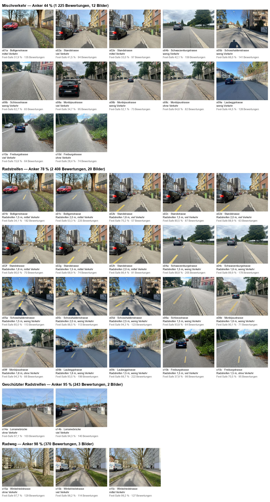

Die Verteilung der Bewertungen über die vier Stufen verdeutlicht die Unterschiede zwischen den Führungsformen. Im Mischverkehr ist «eher unsicher» mit 39 % die häufigste Bewertung, bei Radstreifen «eher sicher» mit 43 %. Zugleich sinkt der Anteil der Bewertung «unsicher» von 17 auf 4 %, während der Anteil «sicher» von 13 auf 35 % steigt.

Bei Radwegen konzentrieren sich die Bewertungen am oberen Ende der Skala: 91 % entfallen auf «sicher», während «unsicher» praktisch nicht mehr vorkommt.

[^anker-1]: Verbesserung belegt · Abstände zwischen den Ankerstufen: Radstreifen gegenüber Mischverkehr +34,2 (+30,5 … +37,7), Radweg-Klasse gegenüber Radstreifen +19,2 (+16,8 … +21,4) Punkte; Genauigkeit der einzelnen Anker Mischverkehr ±3,6, Radstreifen ±2,1, Radweg-Klasse ±1,3 Punkte. 95-%-Bereiche mit Personen-Bootstrap.

Um den Einfluss der Verkehrsmenge sichtbar zu machen, wurden die Bilder mit viel Verkehr zusätzlich getrennt von den übrigen Bildern ausgewertet. Daraus ergeben sich zwei Sätze von Feel-Safe-Ankern:

| Führungsform | viel Verkehr | Bewertungen | übrige (ohne, wenig, mittel) | Bewertungen | alle |
|---|---:|---:|---:|---:|---:|
| Mischverkehr | 32 % | 253 | 47 % | 972 | 44 % |
| Radstreifen | 67 % | 305 | 80 % | 2 103 | 78 % |
| Radweg-Klasse (Radweg + geschützter Radstreifen) | 96 % | 254 | 98 % | 359 | 97 % |

*Bilder mit viel Verkehr (9): [`o02a`](Bilder/o02a.jpg), [`o02b`](Bilder/o02b.jpg), [`o02c`](Bilder/o02c.jpg), [`o02d`](Bilder/o02d.jpg), [`o08a`](Bilder/o08a.jpg), [`o10a`](Bilder/o10a.jpg), [`o10b`](Bilder/o10b.jpg), [`o14b`](Bilder/o14b.jpg), [`o15b`](Bilder/o15b.jpg). Übrige Bilder: ohne, wenig und mittlerer Verkehr (28): [`o01a`](Bilder/o01a.jpg), [`o01b`](Bilder/o01b.jpg), [`o01c`](Bilder/o01c.jpg), [`o02e`](Bilder/o02e.jpg), [`o02f`](Bilder/o02f.jpg), [`o02g`](Bilder/o02g.jpg), [`o02h`](Bilder/o02h.jpg), [`o04a`](Bilder/o04a.jpg), [`o04b`](Bilder/o04b.jpg), [`o04c`](Bilder/o04c.jpg), [`o05a`](Bilder/o05a.jpg), [`o05b`](Bilder/o05b.jpg), [`o05c`](Bilder/o05c.jpg), [`o05d`](Bilder/o05d.jpg), [`o06a`](Bilder/o06a.jpg), [`o06b`](Bilder/o06b.jpg), [`o08b`](Bilder/o08b.jpg), [`o08c`](Bilder/o08c.jpg), [`o08e`](Bilder/o08e.jpg), [`o08f`](Bilder/o08f.jpg), [`o09a`](Bilder/o09a.jpg), [`o09b`](Bilder/o09b.jpg), [`o09c`](Bilder/o09c.jpg), [`o10c`](Bilder/o10c.jpg), [`o10d`](Bilder/o10d.jpg), [`o14a`](Bilder/o14a.jpg), [`o15a`](Bilder/o15a.jpg), [`o15c`](Bilder/o15c.jpg).*

Bei hohem Verkehrsaufkommen liegen die Feel-Safe-Werte im Mischverkehr um 15 Punkte tiefer, auf Radstreifen um 13 und bei baulicher Trennung um 2 Punkte. Radstreifen werden mit einem Wert von 67 % weiterhin deutlich sicherer bewertet als Mischverkehr. Der Abstand zum Radweg vergrössert sich jedoch von 18 auf 30 Punkte. Die Zahlen beschreiben Unterschiede zwischen den beiden Bildgruppen, nicht den isolierten Einfluss der Verkehrsmenge.

**Die 9 Ankerbilder mit viel Verkehr**

<table><tr>
<td>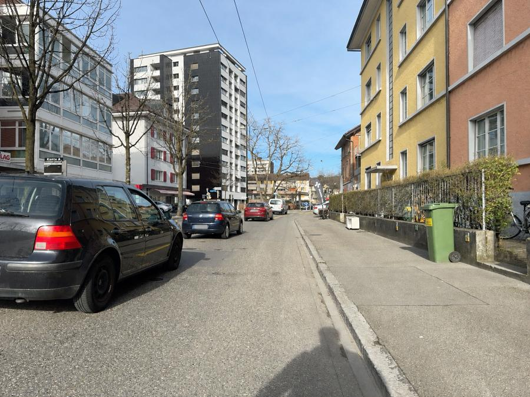 <code>o02a</code> Standstrasse, Mischverkehr · 41,5 %</td>
<td>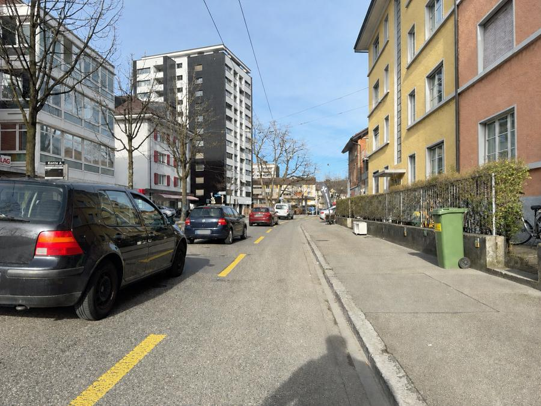 <code>o02b</code> Standstrasse, Radstreifen 1,8 m · 70,2 %</td>
<td>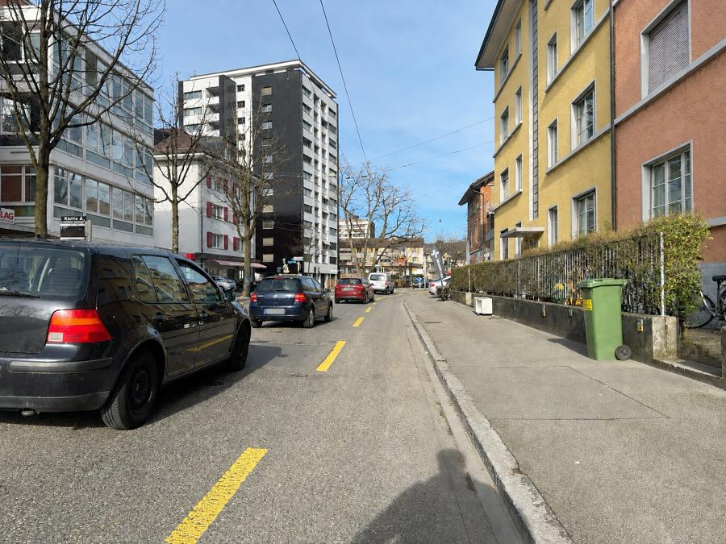 <code>o02c</code> Standstrasse, Radstreifen 1,5 m · 80,5 %</td>
</tr></table>
<table><tr>
<td>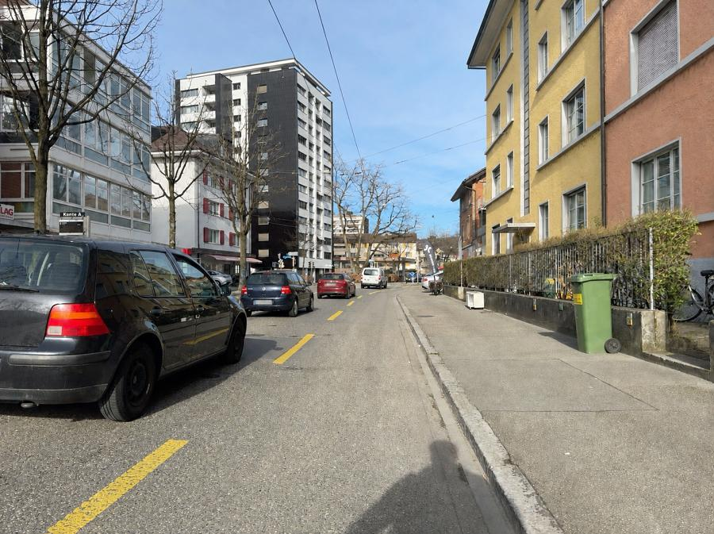 <code>o02d</code> Standstrasse, Radstreifen 2,0 m · 88,9 %</td>
<td>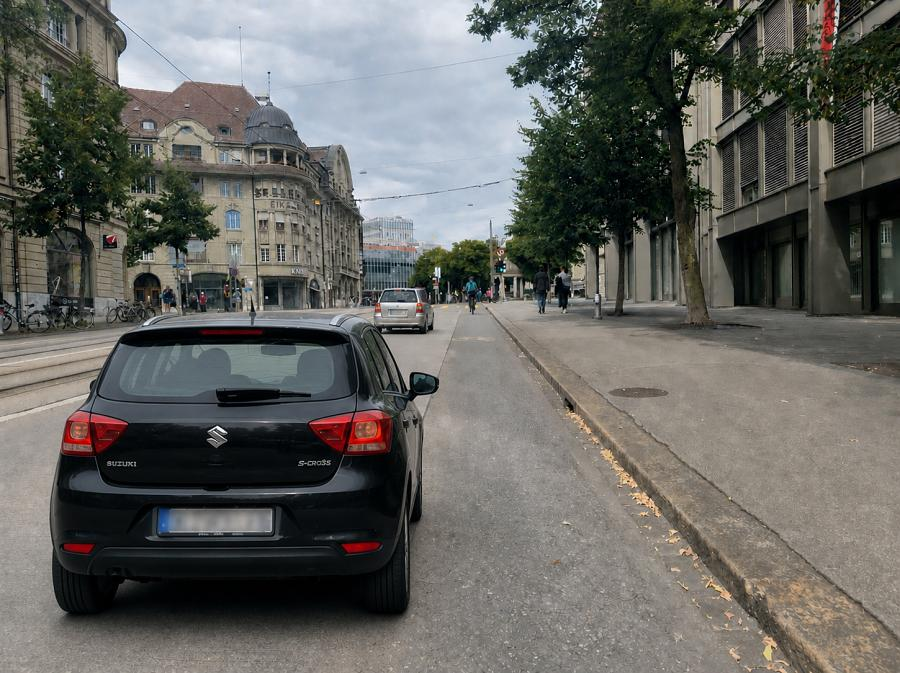 <code>o08a</code> Monbijoustrasse, Mischverkehr · 34,7 %</td>
<td>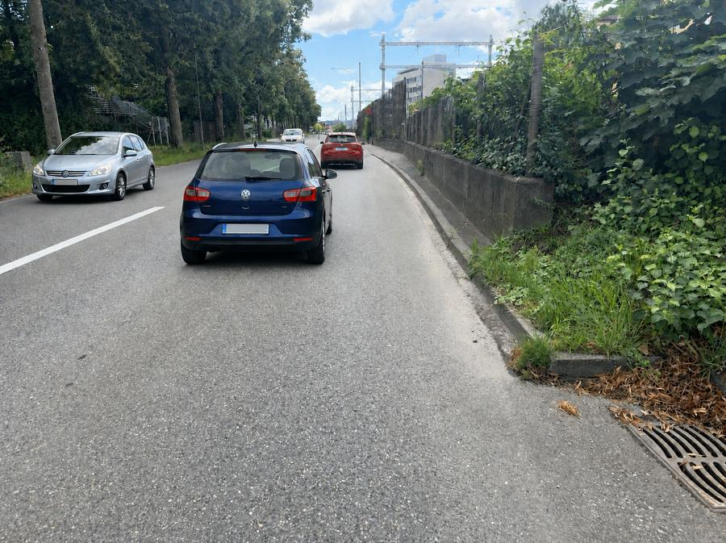 <code>o10a</code> Freiburgstrasse, Mischverkehr · 15,6 %</td>
</tr></table>
<table><tr>
<td>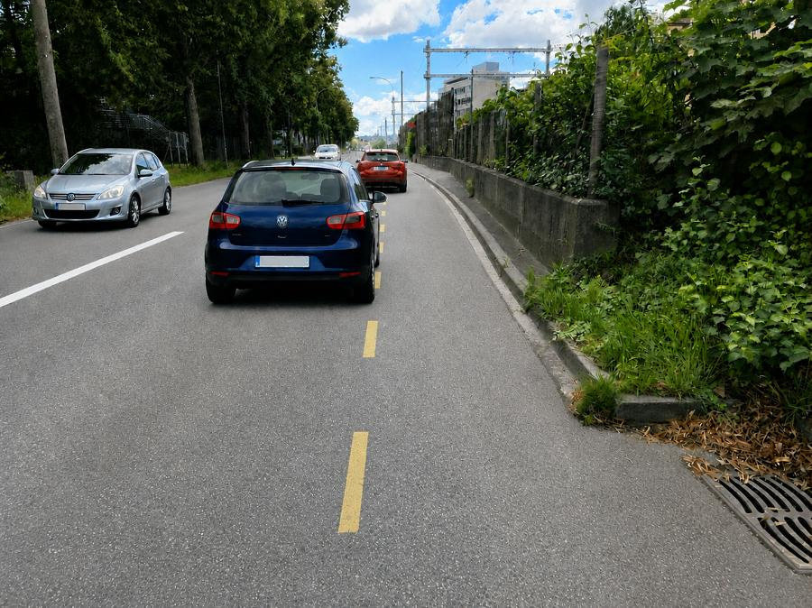 <code>o10b</code> Freiburgstrasse, Radstreifen 1,5 m · 37,8 %</td>
<td>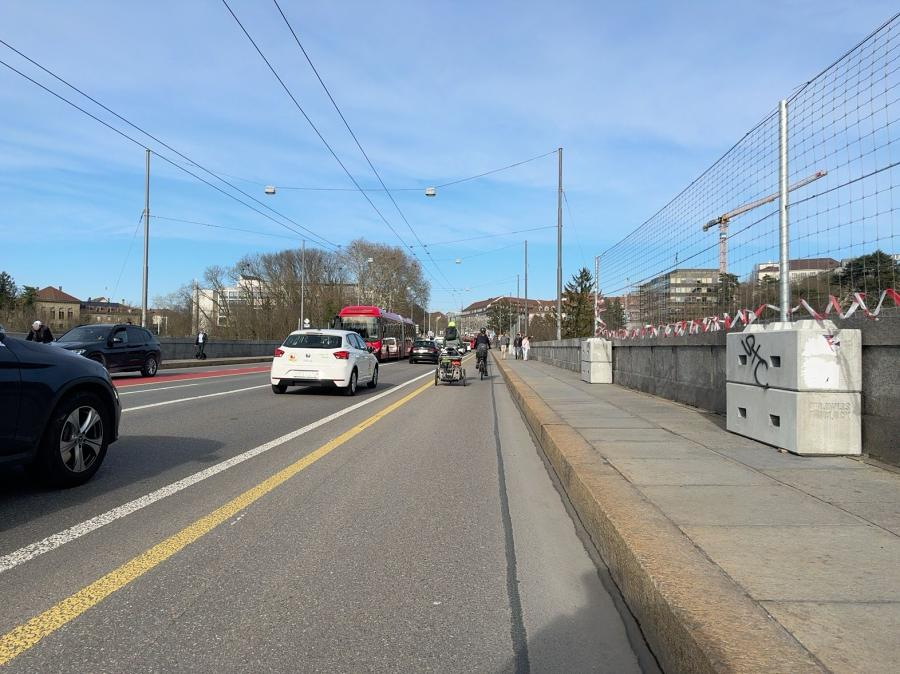 <code>o14b</code> Lorrainebrücke, geschützter Radstreifen · 94,3 %</td>
<td>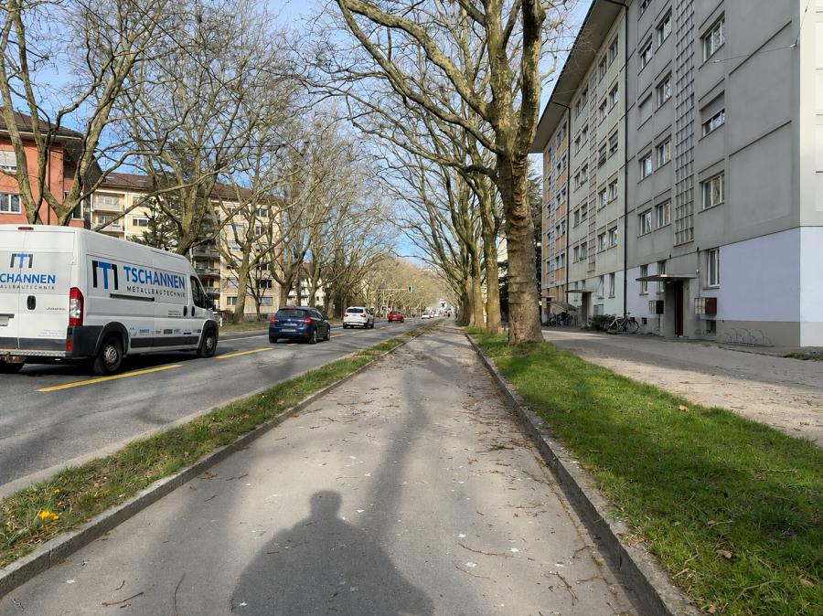 <code>o15b</code> Winkelriedstrasse, Radweg · 98,2 %</td>
</tr></table>

### 2.2 Veloführung an einer Tramhaltestelle
An der Haltestelle Wander unterscheiden sich die beiden Strassenseiten in der Veloführung: stadteinwärts die Kaphaltestelle, bei der zwischen Schienen und hoher Haltekante gefahren werden muss, stadtauswärts die Haltestellenumfahrung. Der Feel-Safe-Wert liegt bei der Kaphaltestelle bei 11 %, bei der Umfahrung bei 96 %. Dieser Vergleich zeigt den grössten beobachteten Unterschied der Umfrage.

| Haltestelle Wander | unsicher | eher unsicher | eher sicher | sicher | Feel-Safe | Bewertungen |
|---|---:|---:|---:|---:|---:|---:|
| Kaphaltestelle | 56 | 32 | 8 | 3 | 11,1 % | 99 |
| Haltestellenumfahrung[^haltestelle-1] | 2 | 2 | 34 | 67 | 96,2 % | 105 |

<table><tr>
<td>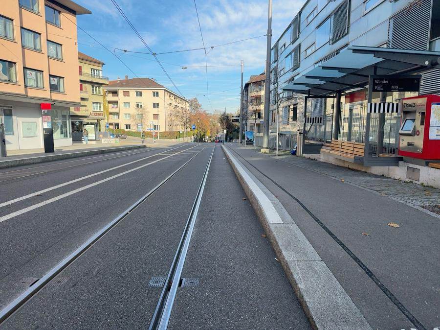 <code>o12a</code> Kaphaltestelle · 11,1 %</td>
<td>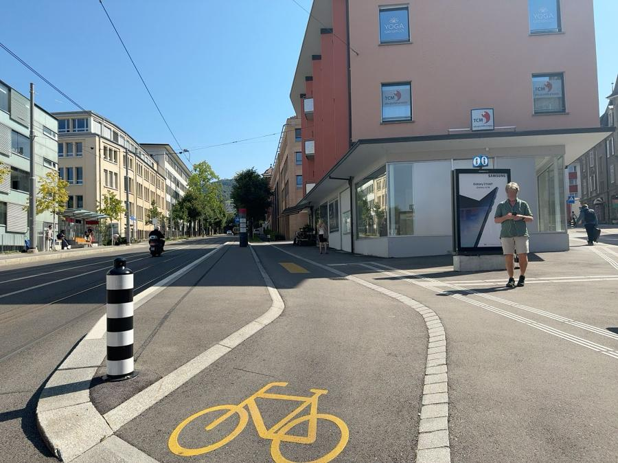 <code>o12b</code> Haltestellenumfahrung · 96,2 %</td>
</tr></table>

Auch die Verteilung auf die vier Antwortstufen zeigt deutliche Unterschiede zwischen den beiden Haltestellensituationen: Bei der Kaphaltestelle bewerten 57 % die Situation als «unsicher», bei der Umfahrung 64 % als «sicher». Da die Bilder unterschiedliche Strassenseiten zeigen, kann der Unterschied jedoch nicht allein auf die Haltestellenform zurückgeführt werden.

[^haltestelle-1]: Verbesserung belegt · Umfahrung statt Kaphaltestelle: +85,1 (+75,6 … +90,4), 99 / 105 Bewertungen.

### 2.3 Fahren entlang von Tramschienen
Wie die Lage der Tramschienen und die Führungsform mit dem Sicherheitsgefühl zusammenhängen, zeigt der Vergleich von drei Varianten der Schlossstrasse. Beim Feel-Safe-Wert zeigen sich deutliche Unterschiede: Schienen am Fahrbahnrand erreichen 10,3 %. Liegen die Schienen in der Fahrbahnmitte, beträgt der Feel-Safe-Wert 56 %. Mit einem Radstreifen neben dem Gleis steigt er auf 77 %. Auch im Berliner Strassencheck war die am schlechtesten bewertete Szene eine Strasse mit Tramschienen (4,6 % «eher sicher» oder «sicher»).

| Schlossstrasse | unsicher | eher unsicher | eher sicher | sicher | Feel-Safe | Bewertungen |
|---|---:|---:|---:|---:|---:|---:|
| Mischverkehr, Schienen in Fahrbahnmitte | 5 | 20 | 19 | 13 | 56,1 % | 57 |
| Radstreifen 1,5 m, Schienen in Fahrbahnmitte[^schienen-2] | 4 | 19 | 44 | 31 | 76,5 % | 98 |
| Mischverkehr, Schienen am Fahrbahnrand[^schienen-1] | 54 | 24 | 8 | 1 | 10,3 % | 87 |

<table><tr>
<td>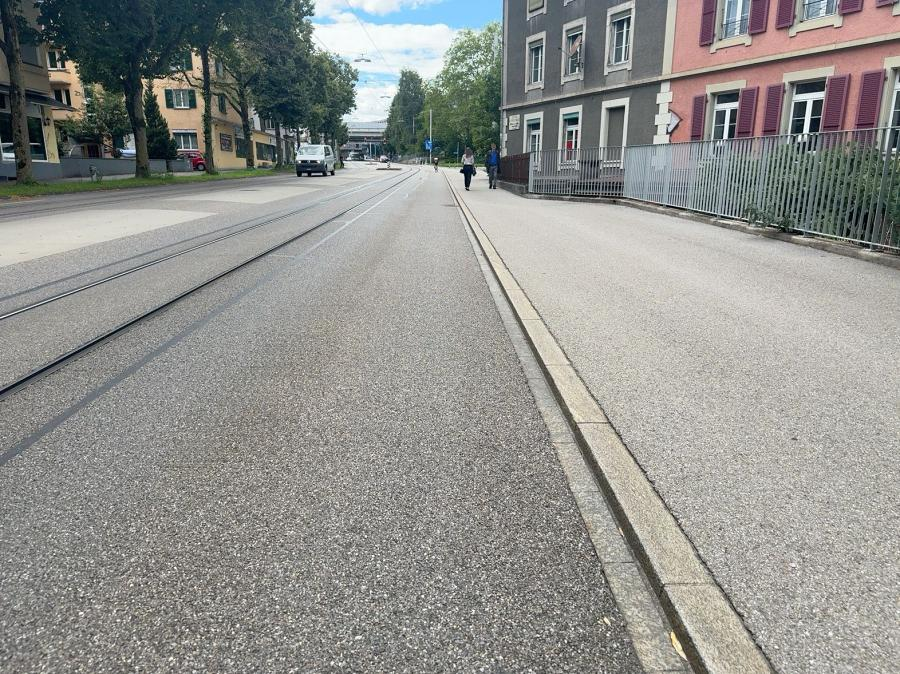 <code>o06e</code> Mischverkehr, Schienen Mitte · 56,1 %</td>
<td>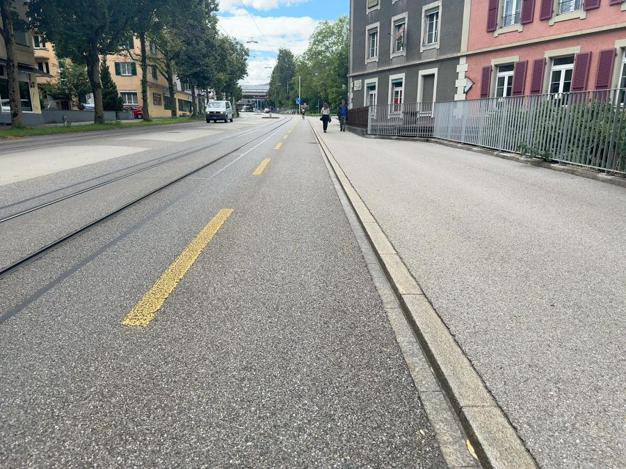 <code>o06d</code> Radstreifen 1,5 m, Schienen Mitte · 76,5 %</td>
<td>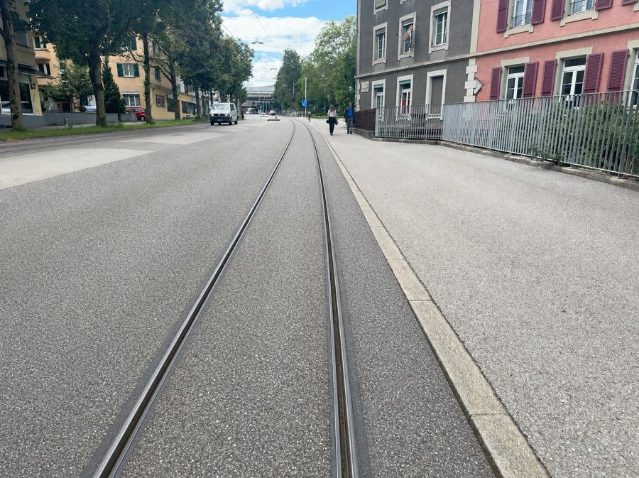 <code>o06c</code> Mischverkehr, Schienen Rand · 10,3 %</td>
</tr></table>

Auch die Verteilung auf die vier Antwortstufen verdeutlicht die unterschiedliche Bewertung. Bei Schienen am Fahrbahnrand bewerten 62 % die Situation als «unsicher». Liegen die Schienen in der Fahrbahnmitte, verteilen sich die Bewertungen stärker über alle vier Stufen. Mit einem Radstreifen neben dem Gleis sinkt der Anteil «eher unsicher» von 35 auf 19 %, während «eher sicher» von 33 auf 45 % steigt. Ob dafür die Markierung selbst oder der grössere Abstand zum Gleis ausschlaggebend ist, bleibt offen.

[^schienen-1]: Verschlechterung belegt · Schienen am Rand statt in der Mitte: −45,8 (−58,8 … −30,6), 57 / 87 Bewertungen.
[^schienen-2]: Verbesserung belegt · Radstreifen statt Mischverkehr neben dem Mittelgleis: +20,4 (+5,1 … +35,2), 57 / 98 Bewertungen.

Ein weiteres Bild der Szene zeigt die Situation mit dem 1,5 m breiten Radstreifen ohne Schienen und erreicht einen Feel-Safe-Wert von 93,8 %. Die Schienen reduzieren den Wert um 17,2 Punkte, obwohl die Führung dieselbe bleibt[^schienen-3]. Die Schienen bleiben damit auch mit Radstreifen spürbar.

<table><tr>
<td>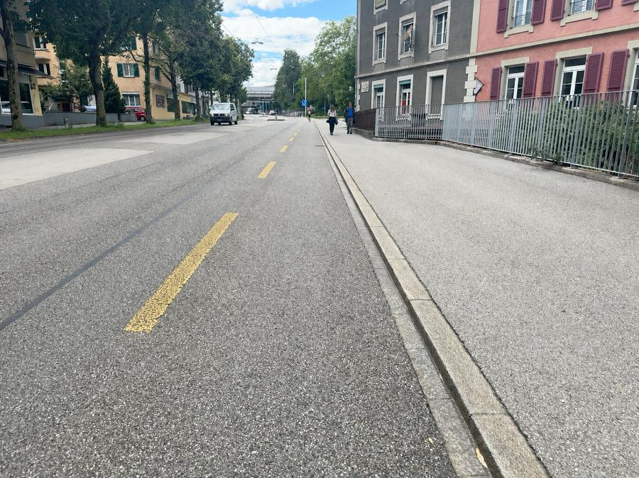 <code>o06a</code> Radstreifen 1,5 m, keine Schienen · 93,8 %</td>
</tr></table>

[^schienen-3]: Verschlechterung belegt · Radstreifen 1,5 m mit Schienen in der Fahrbahnmitte statt ohne Schienen: −17,2 (−27,3 … −5,8), 64 / 98 Bewertungen.

### 2.4 Einfluss der Verkehrsmenge bei abgesetzten Führungsformen
Auf der Lorrainebrücke und an der Winkelriedstrasse wurde nur die Anzahl der Fahrzeuge verändert. Bei den untersuchten getrennten Führungsformen bleiben die Feel-Safe-Werte bei allen dargestellten Verkehrsmengen zwischen 94 und 99 %. Ein Unterschied zwischen den Varianten mit und ohne Verkehr lässt sich statistisch nicht nachweisen.

| | Verkehr | unsicher | eher unsicher | eher sicher | sicher | Feel-Safe | Bewertungen |
|---|---|---:|---:|---:|---:|---:|---:|
| Geschützter Radstreifen (Lorrainebrücke) | ohne[^verkehr-1] | 0 | 3 | 36 | 64 | 97,1 % | 103 |
| Geschützter Radstreifen (Lorrainebrücke) | viel | 2 | 6 | 47 | 85 | 94,3 % | 140 |
| Radweg (Winkelriedstrasse) | ohne[^verkehr-2] | 1 | 2 | 9 | 117 | 97,7 % | 129 |
| Radweg (Winkelriedstrasse) | mittel | 0 | 1 | 7 | 119 | 99,2 % | 127 |
| Radweg (Winkelriedstrasse) | viel | 0 | 2 | 10 | 102 | 98,2 % | 114 |

<table><tr>
<td>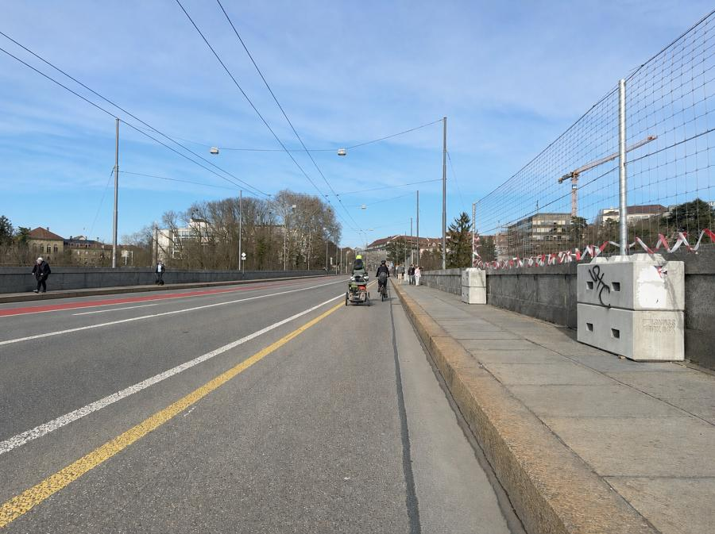 <code>o14a</code> geschützter Radstreifen, ohne Verkehr · 97,1 %</td>
<td> <code>o14b</code> geschützter Radstreifen, viel Verkehr · 94,3 %</td>
</tr></table>
<table><tr>
<td>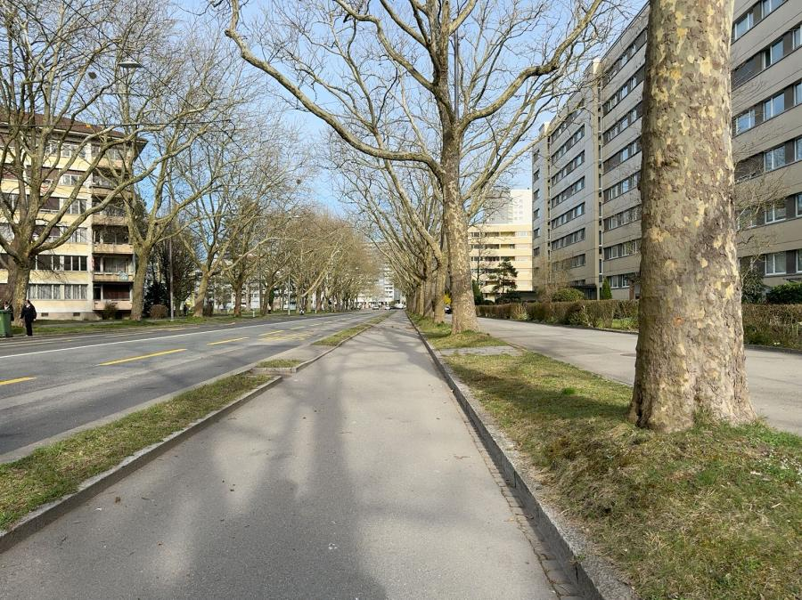 <code>o15a</code> Radweg, ohne Verkehr · 97,7 %</td>
<td>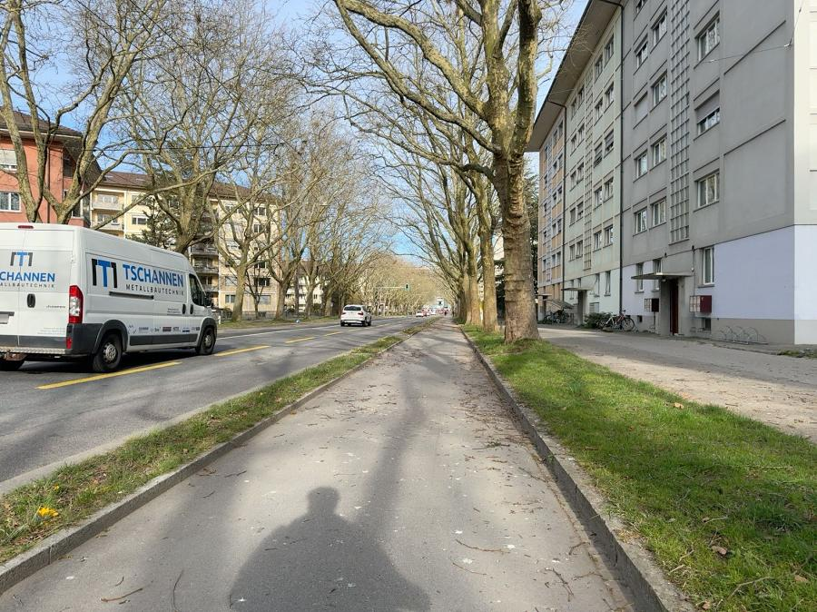 <code>o15c</code> Radweg, mittlerer Verkehr · 99,2 %</td>
<td> <code>o15b</code> Radweg, viel Verkehr · 98,2 %</td>
</tr></table>

[^verkehr-1]: Unterschied nicht nachgewiesen · Geschützter Radstreifen, ohne statt viel Verkehr: +2,8 (−3,2 … +8,3), 140 / 103 Bewertungen.
[^verkehr-2]: Unterschied nicht nachgewiesen · Radweg, ohne statt viel Verkehr: −0,6 (−5,0 … +4,1), 114 / 129 Bewertungen.

### 2.5 Einfluss der Verkehrsmenge ohne bauliche Trennung
An der Monbijoustrasse und an der Freiburgstrasse wurde die Zahl der Autos verändert. Ohne bauliche Trennung zeigt sich ein deutlicher Zusammenhang zwischen Verkehrsmenge und Sicherheitsgefühl: Im Mischverkehr der Monbijoustrasse sinkt der Feel-Safe-Wert von 65 % ohne Verkehr über 52 % bei wenig Verkehr auf 35 % bei viel Verkehr. Beim 1,5 m breiten Radstreifen an der Freiburgstrasse sinkt er von 71 % ohne Verkehr auf 38 % bei viel Verkehr.

| | Verkehr | unsicher | eher unsicher | eher sicher | sicher | Feel-Safe | Bewertungen |
|---|---|---:|---:|---:|---:|---:|---:|
| Mischverkehr (Monbijoustrasse) | ohne | 4 | 25 | 37 | 16 | 64,6 % | 82 |
| Mischverkehr (Monbijoustrasse) | wenig[^verkehr-3] | 8 | 27 | 24 | 14 | 52,1 % | 73 |
| Mischverkehr (Monbijoustrasse) | viel[^verkehr-4] | 21 | 41 | 27 | 6 | 34,7 % | 95 |
| Radstreifen 1,5 m (Freiburgstrasse) | ohne | 4 | 24 | 41 | 26 | 70,5 % | 95 |
| Radstreifen 1,5 m (Freiburgstrasse) | viel[^verkehr-5] | 25 | 36 | 27 | 10 | 37,8 % | 98 |

<table><tr>
<td>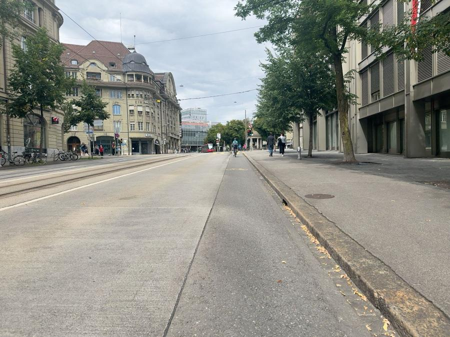 <code>o08c</code> Mischverkehr, ohne Verkehr · 64,6 %</td>
<td>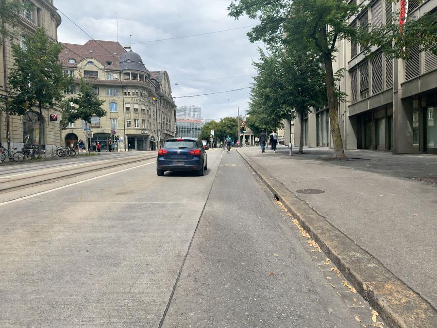 <code>o08b</code> Mischverkehr, wenig Verkehr · 52,1 %</td>
<td> <code>o08a</code> Mischverkehr, viel Verkehr · 34,7 %</td>
</tr></table>
<table><tr>
<td>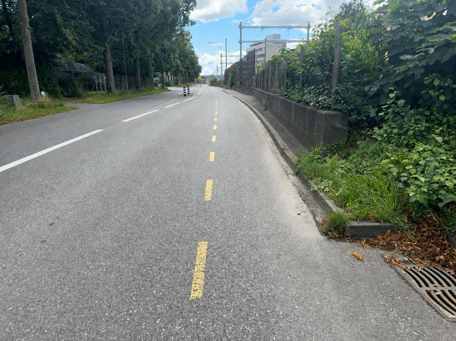 <code>o10c</code> Radstreifen 1,5 m, ohne Verkehr · 70,5 %</td>
<td> <code>o10b</code> Radstreifen 1,5 m, viel Verkehr · 37,8 %</td>
</tr></table>

Mit zunehmender Verkehrsmenge verschieben sich die Bewertungen in Richtung «eher unsicher» und «unsicher». Der 1,5 m breite Radstreifen bei viel Verkehr erreicht 38 %, der Mischverkehr derselben Strasse ohne Verkehr 28 % — ein Unterschied von 9 Punkten.

[^verkehr-3]: Unterschied nicht nachgewiesen · Mischverkehr, wenig statt ohne Verkehr: −12,6 (−27,3 … +2,9), 82 / 73 Bewertungen.
[^verkehr-4]: Verschlechterung belegt · Mischverkehr, viel statt ohne Verkehr: −29,9 (−42,8 … −15,2), 82 / 95 Bewertungen.
[^verkehr-5]: Verschlechterung belegt · Radstreifen 1,5 m, viel statt ohne Verkehr: −32,8 (−44,9 … −18,8), 95 / 98 Bewertungen.

### 2.6 Einfluss der Parkierung
An der Marienstrasse wurde der Einfluss parkierter Autos auf das Sicherheitsgefühl im Mischverkehr untersucht: ohne fahrenden Verkehr, jeweils ohne Parkierung, mit einseitiger Parkierung auf der in Fahrtrichtung linken Seite und mit beidseitiger Parkierung. Die Parkierung links kostet 10 Punkte, die zusätzliche Parkierung rechts auf der Veloseite weitere 45: Von 93 % ohne Parkierung bleiben 38 %.

| Marienstrasse | unsicher | eher unsicher | eher sicher | sicher | Feel-Safe | Bewertungen |
|---|---:|---:|---:|---:|---:|---:|
| keine Parkierung | 1 | 7 | 53 | 56 | 93,2 % | 117 |
| einseitig, links[^parkierung-1] | 1 | 15 | 43 | 35 | 83,0 % | 94 |
| beidseitig[^parkierung-2] | 16 | 48 | 31 | 9 | 38,5 % | 104 |

<table><tr>
<td>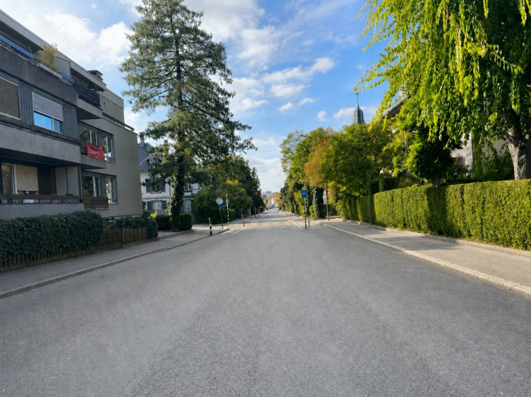 <code>o13a</code> keine Parkierung · 93,2 %</td>
<td>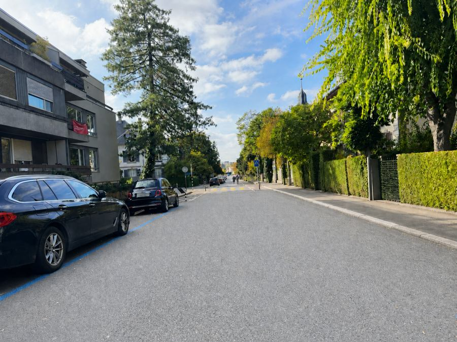 <code>o13b</code> einseitig, links · 83,0 %</td>
<td>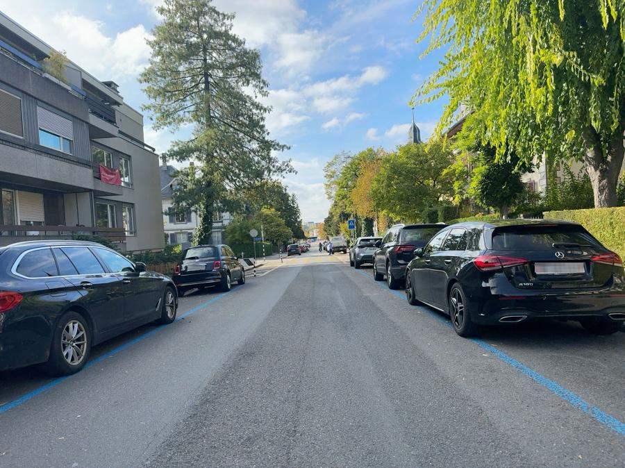 <code>o13c</code> beidseitig · 38,5 %</td>
</tr></table>

In der Umfrage wurden zwei weitere Szenen mit einseitiger Parkierung gezeigt. Für beide gibt es kein Bild ohne Parkierung, deshalb kein Vergleich, nur das Niveau: Fabrikstrasse 67 % sowie Länggassstrasse 25 %.

| Einseitige Parkierung, Mischverkehr, ohne Verkehr | unsicher | eher unsicher | eher sicher | sicher | Feel-Safe | Bewertungen |
|---|---:|---:|---:|---:|---:|---:|
| Fabrikstrasse | 8 | 47 | 85 | 29 | 67,5 % | 169 |
| Länggassstrasse | 59 | 81 | 40 | 6 | 24,7 % | 186 |

<table><tr>
<td> <code>o11a</code> Fabrikstrasse, einseitige Parkierung rechts · 67,5 %</td>
<td>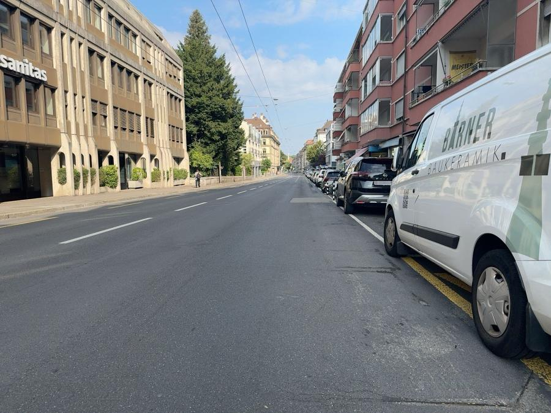 <code>o03c</code> Länggassstrasse, einseitige Parkierung rechts · 24,7 %</td>
</tr></table>

Besonders tief fallen die Bewertungen dort aus, wo die Parkierung auf der Veloseite liegt. An der Marienstrasse sinkt der Feel-Safe-Wert mit zusätzlicher Parkierung rechts um 45 Prozentpunkte. Auch die [Länggassstrasse](Bilder/o03c.jpg) mit Parkierung rechts gehört mit 25 % zu den am schlechtesten bewerteten Bildern der Umfrage. Selbst mit einem 1,8 m breiten Radstreifen erreicht die Szene nur [46](Bilder/o03b.jpg) bis [55](Bilder/o03a.jpg) % (siehe «Abweislinie»). Zum Vergleich: 1,8 m breite Radstreifen ohne Parkierung erreichen bei keinem oder wenig Verkehr an anderen untersuchten Orten 90 bis 94 %. Die Fabrikstrasse mit einseitiger Parkierung liegt mit 67 % dazwischen.

Auch der Berliner Strassencheck weist auf einen negativen Zusammenhang zwischen Parkierung und Sicherheitsgefühl hin. «Parkplätze machen besonders viel Angst». (Tagesspiegel, Berliner Strassencheck, 2020).

[^parkierung-1]: Verschlechterung belegt · Parkierung links statt keine: −10,2 (−19,6 … −1,5), 117 / 94 Bewertungen.
[^parkierung-2]: Verschlechterung belegt · Beidseitige statt nur linke Parkierung: −44,5 (−55,3 … −31,5), 94 / 104 Bewertungen.

### 2.7 Einfluss einer Abweislinie bei Parkierung
Ob eine Abweislinie entlang von Längsparkplätzen das Sicherheitsgefühl verbessert, wurde mit Fotos der Fabrikstrasse und der Länggassstrasse untersucht. An der Fabrikstrasse liegt der Wert mit Abweislinie um 12 Punkte tiefer. An der Länggassstrasse liegt er mit Abweislinie um 9 Punkte höher. Die beobachteten Unterschiede weisen an den beiden Orten in entgegengesetzte Richtungen. ein Sicherheitsgewinn ist an keinem der beiden Orte belegt. Zu untersuchen wäre, ob die Abgrenzungsmarkierung in anderen Situationen einen Effekt hat. Der Berliner Strassencheck fand keinen Gewinn: «Auffällig ist, dass es das Sicherheitsgefühl kaum erhöht, wenn eine Linie davor warnt, dass sich jeden Moment eine Autotür öffnen könnte. Die sogenannten ‚Dooring Linien‘ können den Radweg sogar gefühlt kleiner machen.» (Tagesspiegel, Berliner Strassencheck, 2020)

| Fabrikstrasse | unsicher | eher unsicher | eher sicher | sicher | Feel-Safe | Bewertungen |
|---|---:|---:|---:|---:|---:|---:|
| ohne Abweislinie | 8 | 47 | 85 | 29 | 67,5 % | 169 |
| mit Abweislinie[^abweislinie-1] | 21 | 59 | 79 | 19 | 55,1 % | 178 |

<table><tr>
<td> <code>o11a</code> Mischverkehr, ohne Abweislinie · 67,5 %</td>
<td>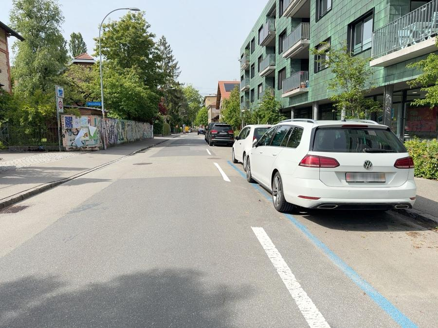 <code>o11b</code> Mischverkehr, mit Abweislinie · 55,1 %</td>
</tr></table>

| Länggassstrasse | unsicher | eher unsicher | eher sicher | sicher | Feel-Safe | Bewertungen |
|---|---:|---:|---:|---:|---:|---:|
| ohne Abweislinie | 19 | 72 | 58 | 20 | 46,2 % | 169 |
| mit Abweislinie[^abweislinie-2] | 19 | 41 | 52 | 22 | 55,2 % | 134 |

<table><tr>
<td>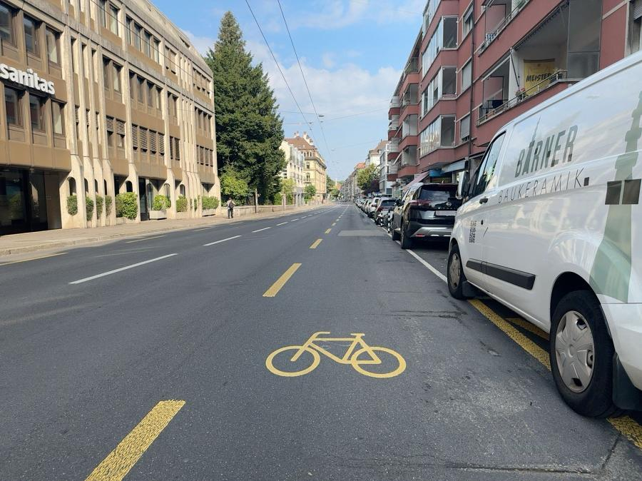 <code>o03b</code> Radstreifen 1,8 m, ohne Abweislinie · 46,2 %</td>
<td>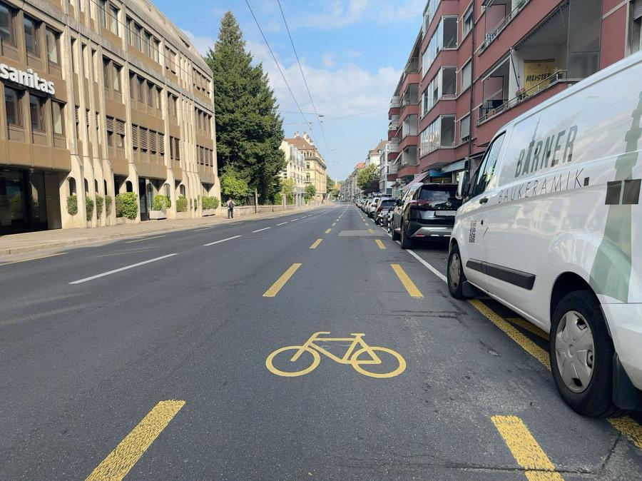 <code>o03a</code> Radstreifen 1,8 m, mit Abweislinie · 55,2 %</td>
</tr></table>

[^abweislinie-1]: Verschlechterung belegt · Abweislinie an der Fabrikstrasse: −12,4 (−22,3 … −2,1), 169 / 178 Bewertungen.
[^abweislinie-2]: Unterschied nicht nachgewiesen · Abweislinie an der Länggassstrasse: +9,1 (−2,2 … +20,0), 169 / 134 Bewertungen.

### 2.8 Bolligenstrasse: Mischverkehr, 1,5 m und 2,0 m
Für denselben Abschnitt der Bolligenstrasse wurden bei mittlerem Verkehr drei Varianten verglichen: Mischverkehr sowie ein 1,5 m und ein 2,0 m breiter Radstreifen. Der 1,5 m breite Radstreifen führt gegenüber dem Mischverkehr zu keiner nachweisbaren Veränderung des Sicherheitsgefühls. Beim 2,0 m breiten Radstreifen steigt der Feel-Safe-Wert dagegen von 32 auf 53 %.

| Bolligenstrasse | unsicher | eher unsicher | eher sicher | sicher | Feel-Safe | Bewertungen |
|---|---:|---:|---:|---:|---:|---:|
| Mischverkehr | 41 | 51 | 31 | 12 | 31,9 % | 135 |
| Radstreifen 1,5 m[^mindestbreite-1] | 38 | 82 | 50 | 12 | 34,1 % | 182 |
| Radstreifen 2,0 m[^mindestbreite-2][^mindestbreite-3] | 23 | 82 | 85 | 35 | 53,3 % | 225 |

<table><tr>
<td> <code>o01a</code> Mischverkehr · 31,9 %</td>
<td>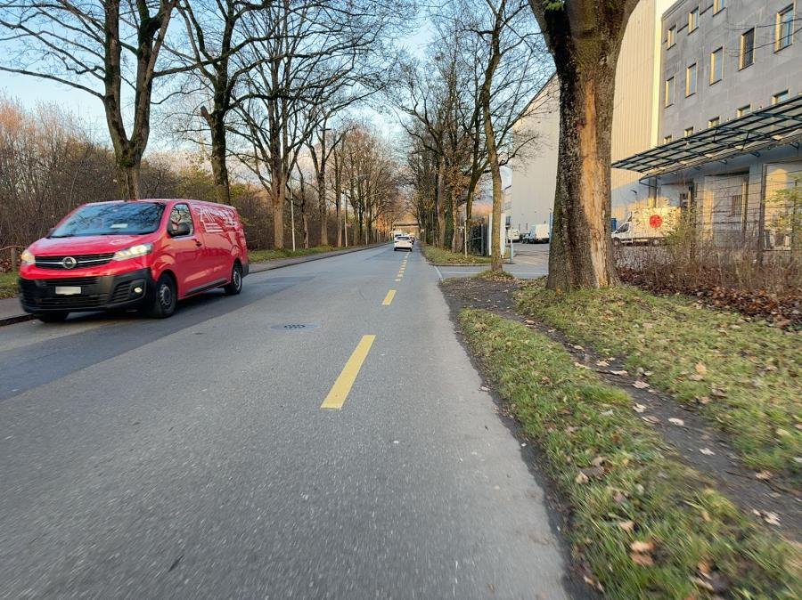 <code>o01b</code> Radstreifen 1,5 m · 34,1 %</td>
<td> <code>o01c</code> Radstreifen 2,0 m · 53,3 %</td>
</tr></table>

In dieser Szene ist Gegenverkehr sichtbar, was die Bewertung beeinflusst haben könnte und was dieses Bild von den Szenen der Laubegg- und Schwarzenburgstrasse unterscheidet (siehe 2.10 und 2.11).

[^mindestbreite-1]: Unterschied nicht nachgewiesen · Radstreifen 1,5 m statt Mischverkehr: +2,2 (−8,3 … +12,4), 135 / 182 Bewertungen.
[^mindestbreite-2]: Verbesserung belegt · Radstreifen 2,0 m statt Mischverkehr: +21,5 (+11,0 … +31,2), 135 / 225 Bewertungen.
[^mindestbreite-3]: Verbesserung belegt · 2,0 m statt 1,5 m: +19,3 (+9,6 … +28,4), 182 / 225 Bewertungen.

### 2.9 Freiburgstrasse: Radstreifen bei viel Verkehr
An der stark befahrenen Freiburgstrasse wurde die Situation im Mischverkehr mit einer Variante mit 1,5 m breitem Radstreifen verglichen. Der Streifen hebt das Sicherheitsgefühl nur von 16 auf 38 %.

| Freiburgstrasse | unsicher | eher unsicher | eher sicher | sicher | Feel-Safe | Bewertungen |
|---|---:|---:|---:|---:|---:|---:|
| Mischverkehr | 32 | 22 | 9 | 1 | 15,6 % | 64 |
| Radstreifen 1,5 m[^ort10-1] | 25 | 36 | 27 | 10 | 37,8 % | 98 |

<table><tr>
<td> <code>o10a</code> Mischverkehr · 15,6 %</td>
<td> <code>o10b</code> Radstreifen 1,5 m · 37,8 %</td>
</tr></table>

Auch in dieser Szene ist Gegenverkehr zu sehen und ein Auto fährt entlang des Radstreifens. In dieser Situation bewirkt ein 1,5-m-Streifen weniger (15,6 % → 37,8 %), als es gemäss den Feel-Safe-Ankern (44 % → 78 %) zu erwarten wäre.

[^ort10-1]: Verbesserung belegt · Radstreifen 1,5 m statt Mischverkehr bei viel Verkehr: +22,1 (+8,1 … +34,2), 64 / 98 Bewertungen.

### 2.10 Laubeggstrasse: Mischverkehr, 1,5 m und 1,8 m
Der Vergleich an der Laubeggstrasse zeigt, wie sich die Bewertungen bei wenig Verkehr zwischen Mischverkehr und Radstreifen mit 1,5 m beziehungsweise 1,8 m Breite unterscheiden. Mit dem 1,5 m breiten Radstreifen steigt der Feel-Safe-Wert von 45 auf 89 %, mit dem 1,8 m breiten Radstreifen auf 93 %. Der zusätzliche Unterschied von 4,7 Prozentpunkten gegenüber dem 1,5 m breiten Radstreifen ist statistisch nicht nachgewiesen.

| Laubeggstrasse | unsicher | eher unsicher | eher sicher | sicher | Feel-Safe | Bewertungen |
|---|---:|---:|---:|---:|---:|---:|
| Mischverkehr | 19 | 52 | 41 | 16 | 44,5 % | 128 |
| Radstreifen 1,5 m[^ort9-1] | 4 | 21 | 100 | 97 | 88,7 % | 222 |
| Radstreifen 1,8 m[^ort9-2] | 0 | 13 | 85 | 101 | 93,5 % | 199 |

<table><tr>
<td>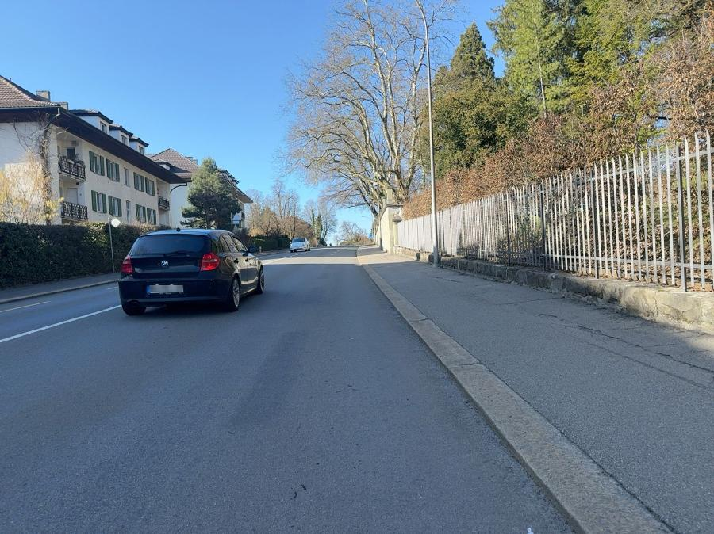 <code>o09a</code> Mischverkehr · 44,5 %</td>
<td>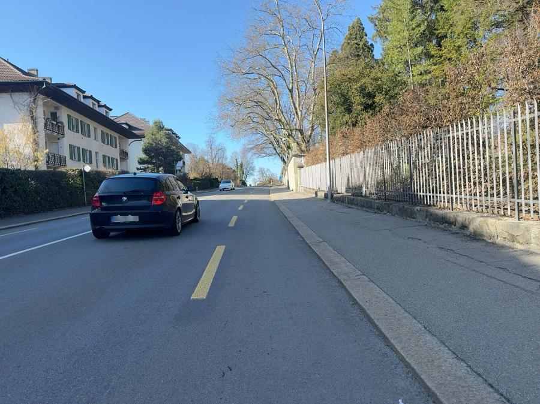 <code>o09c</code> Radstreifen 1,5 m · 88,7 %</td>
<td> <code>o09b</code> Radstreifen 1,8 m · 93,5 %</td>
</tr></table>

[^ort9-1]: Verbesserung belegt · Radstreifen 1,5 m statt Mischverkehr: +44,2 (+34,3 … +53,2), 128 / 222 Bewertungen.
[^ort9-2]: Unterschied nicht nachgewiesen · 1,8 m statt 1,5 m: +4,7 (−0,8 … +10,3), 222 / 199 Bewertungen.

### 2.11 Schwarzenburgstrasse: Mischverkehr, 1,5 m und 1,8 m
Dieselben Führungsvarianten wurden auch an der Schwarzenburgstrasse gegenübergestellt. Mit dem 1,5 m breiten Radstreifen steigt der Feel-Safe-Wert von 42 auf 89 %. Beim 1,8 m breiten Radstreifen liegt er nochmals rund einen Prozentpunkt höher. Dieser Unterschied gegenüber dem 1,5 m breiten Radstreifen ist statistisch nicht nachgewiesen.

| Schwarzenburgstrasse | unsicher | eher unsicher | eher sicher | sicher | Feel-Safe | Bewertungen |
|---|---:|---:|---:|---:|---:|---:|
| Mischverkehr | 24 | 68 | 49 | 18 | 42,1 % | 159 |
| Radstreifen 1,5 m[^ort4-1] | 4 | 19 | 99 | 83 | 88,8 % | 205 |
| Radstreifen 1,8 m[^ort4-2] | 2 | 16 | 83 | 77 | 89,9 % | 178 |

<table><tr>
<td>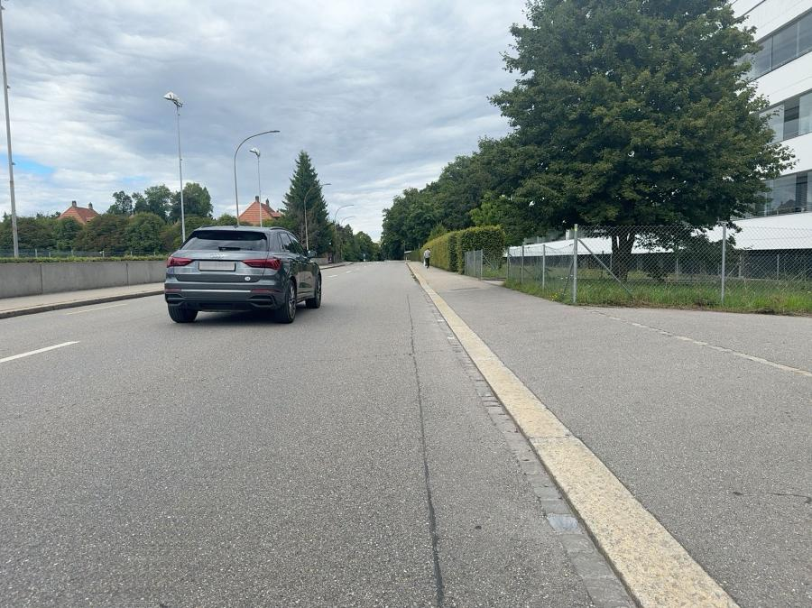 <code>o04b</code> Mischverkehr · 42,1 %</td>
<td>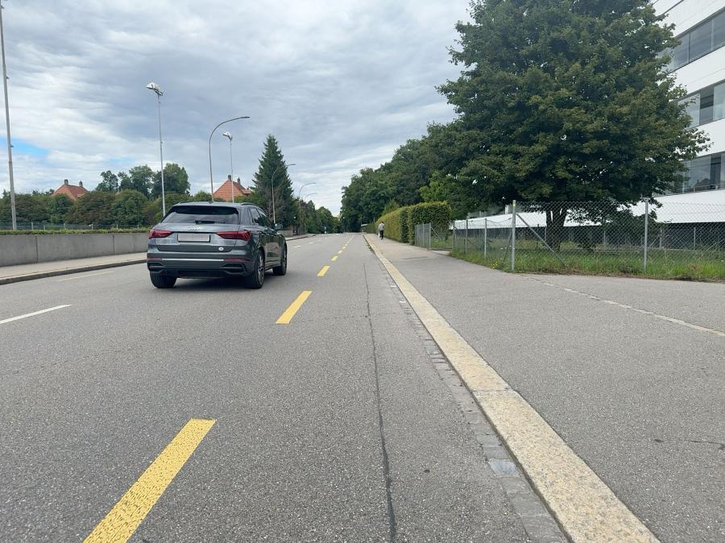 <code>o04a</code> Radstreifen 1,5 m · 88,8 %</td>
<td>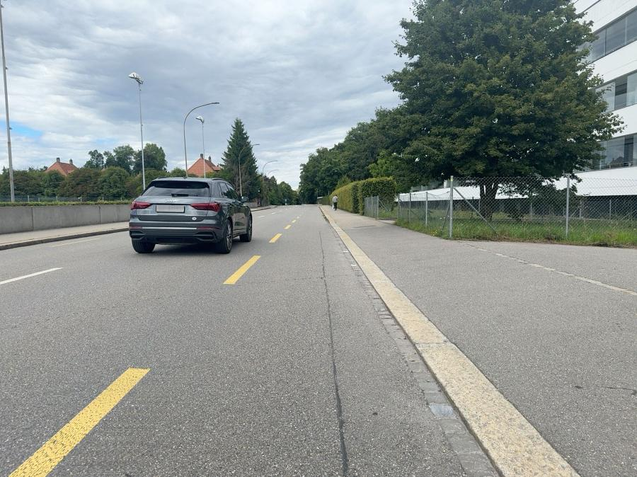 <code>o04c</code> Radstreifen 1,8 m · 89,9 %</td>
</tr></table>

Der Anteil der Bewertung «sicher» steigt von 11 % im Mischverkehr auf 40 % beim 1,5 m breiten und auf 43 % beim 1,8 m breiten Radstreifen.

[^ort4-1]: Verbesserung belegt · Radstreifen 1,5 m statt Mischverkehr: +46,6 (+37,4 … +54,9), 159 / 205 Bewertungen.
[^ort4-2]: Unterschied nicht nachgewiesen · 1,8 m statt 1,5 m: +1,1 (−5,3 … +7,3), 205 / 178 Bewertungen.

### 2.12 Breiteneffekt 1,5 → 1,8 m
An drei Orten unterscheiden sich die Bildpaare ausschliesslich in der Breite des Radstreifens. Werden die Bewertungen dieser drei Bildpaare zusammengefasst, liegt der Feel-Safe-Wert beim 1,8 m breiten Radstreifen 5,7 Prozentpunkte höher als beim 1,5 m breiten. Der 95-%-Vertrauensbereich reicht von +2,1 bis +9,4 Prozentpunkten.

| Paare 1,5 m → 1,8 m | unsicher | eher unsicher | eher sicher | sicher | Feel-Safe | Bewertungen |
|---|---:|---:|---:|---:|---:|---:|
| Standstrasse · mittlerer Verkehr, 1,5 m ([`o02g`](Bilder/o02g.jpg)) | 3 | 20 | 32 | 19 | 68,9 % | 74 |
| Standstrasse · mittlerer Verkehr, 1,8 m ([`o02f`](Bilder/o02f.jpg))[^ort2m-2] | 0 | 7 | 36 | 27 | 90,0 % | 70 |
| Schwarzenburgstrasse, 1,5 m ([`o04a`](Bilder/o04a.jpg)) | 4 | 19 | 99 | 83 | 88,8 % | 205 |
| Schwarzenburgstrasse, 1,8 m ([`o04c`](Bilder/o04c.jpg))[^ort4-2] | 2 | 16 | 83 | 77 | 89,9 % | 178 |
| Laubeggstrasse, 1,5 m ([`o09c`](Bilder/o09c.jpg)) | 4 | 21 | 100 | 97 | 88,7 % | 222 |
| Laubeggstrasse, 1,8 m ([`o09b`](Bilder/o09b.jpg))[^ort9-2] | 0 | 13 | 85 | 101 | 93,5 % | 199 |
| **die drei Bildpaare zusammen, 1,5 m** | 11 | 60 | 231 | 199 | 85,8 % | 501 |
| **die drei Bildpaare zusammen, 1,8 m**[^breite-1] | 2 | 36 | 204 | 205 | 91,5 % | 447 |

Die drei Vergleiche stammen von der Standstrasse bei mittlerem Verkehr sowie von der Schwarzenburgstrasse und der Laubeggstrasse bei wenig Verkehr. Der Befund gilt damit für Situationen mit wenig bis mittlerem Verkehr. Ob sich ein vergleichbarer Breiteneffekt auch bei viel Verkehr zeigt, müsste mit zusätzlichen Bildpaaren untersucht werden.

[^breite-1]: Verbesserung belegt · 1,8 m statt 1,5 m, drei Bildpaare zusammen: +5,7 (+2,1 … +9,4), 501 / 447 Bewertungen. Bereich per Personen-Bootstrap, weil jede Person mehrere Bilder bewertet hat (siehe Rechenbeispiel 2).
[^ort2m-2]: Verbesserung belegt · 1,8 m statt 1,5 m: +21,1 (+7,9 … +33,4), 74 / 70 Bewertungen.

### 2.13 Breiteneffekt 1,5 → 2,0 m
Für die Verbreiterung von 1,5 auf 2,0 m stehen vier Bildpaare zur Verfügung. Werden ihre Bewertungen zusammengefasst, beträgt der Unterschied 10,6 Prozentpunkte zugunsten des breiteren Radstreifens, bei einem 95-%-Vertrauensbereich von +5,3 bis +16,0 Prozentpunkten.

| Paare 1,5 m → 2,0 m | unsicher | eher unsicher | eher sicher | sicher | Feel-Safe | Bewertungen |
|---|---:|---:|---:|---:|---:|---:|
| Bolligenstrasse, 1,5 m ([`o01b`](Bilder/o01b.jpg)) | 38 | 82 | 50 | 12 | 34,1 % | 182 |
| Bolligenstrasse, 2,0 m ([`o01c`](Bilder/o01c.jpg))[^mindestbreite-3] | 23 | 82 | 85 | 35 | 53,3 % | 225 |
| Standstrasse · viel Verkehr, 1,5 m ([`o02c`](Bilder/o02c.jpg)) | 1 | 16 | 38 | 32 | 80,5 % | 87 |
| Standstrasse · viel Verkehr, 2,0 m ([`o02d`](Bilder/o02d.jpg))[^ort2v-4] | 0 | 7 | 38 | 18 | 88,9 % | 63 |
| Standstrasse · mittlerer Verkehr, 1,5 m ([`o02g`](Bilder/o02g.jpg)) | 3 | 20 | 32 | 19 | 68,9 % | 74 |
| Standstrasse · mittlerer Verkehr, 2,0 m ([`o02h`](Bilder/o02h.jpg))[^ort2m-4] | 1 | 10 | 47 | 23 | 86,4 % | 81 |
| Schosshaldenstrasse, 1,5 m ([`o05a`](Bilder/o05a.jpg)) | 1 | 16 | 64 | 32 | 85,0 % | 113 |
| Schosshaldenstrasse, 2,0 m ([`o05c`](Bilder/o05c.jpg))[^ort5-2] | 0 | 13 | 45 | 55 | 88,5 % | 113 |
| **die vier Bildpaare zusammen, 1,5 m** | 43 | 134 | 184 | 95 | 61,2 % | 456 |
| **die vier Bildpaare zusammen, 2,0 m**[^breite-2] | 24 | 112 | 215 | 131 | 71,8 % | 482 |

Die vier Vergleiche stammen von der Bolligenstrasse, der Standstrasse bei viel Verkehr, der Standstrasse bei mittlerem Verkehr sowie von der Schosshaldenstrasse. Einzeln nachgewiesen sind zwei der vier Vergleiche (die Bolligenstrasse mit +19,3, die Standstrasse bei mittlerem Verkehr mit +17,5). Die übrigen zeigen dieselbe Richtung, sind für sich aber zu unsicher (+8,4 und +3,5). 

[^ort2v-4]: Unterschied nicht nachgewiesen · 2,0 m statt 1,5 m: +8,4 (−3,8 … +19,5), 87 / 63 Bewertungen.
[^ort2m-4]: Verbesserung belegt · 2,0 m statt 1,5 m: +17,5 (+4,4 … +30,2), 74 / 81 Bewertungen.
[^ort5-2]: Unterschied nicht nachgewiesen · 2,0 m statt 1,5 m: +3,5 (−5,5 … +12,6), 113 / 113 Bewertungen.
[^breite-2]: Verbesserung belegt · 2,0 m statt 1,5 m, vier Bildpaare zusammen: +10,6 (+5,3 … +16,0), 456 / 482 Bewertungen. Bereich per Personen-Bootstrap, weil jede Person mehrere Bilder bewertet hat (siehe Rechenbeispiel 2).

### 2.14 Sonderfall: ein Auto auf dem Radstreifen
Das Bild o08d zeigt einen 1,8 m breiten Radstreifen, der teilweise von einem Auto befahren wird. Dies wurde erst nachträglich bemerkt – deshalb wird das Bild weder für die Feel-Safe-Anker noch für den Breitenvergleich verwendet. Es erlaubt jedoch eine Betrachtung dieser speziellen Situation.

| Monbijoustrasse | unsicher | eher unsicher | eher sicher | sicher | Feel-Safe | Bewertungen |
|---|---:|---:|---:|---:|---:|---:|
| Mischverkehr, viel Verkehr | 21 | 41 | 27 | 6 | 34,7 % | 95 |
| Radstreifen 1,8 m, von einem Auto belegt, viel Verkehr | 10 | 25 | 17 | 5 | 38,6 % | 57 |

<table><tr>
<td> <code>o08a</code> Mischverkehr · 34,7 %</td>
<td>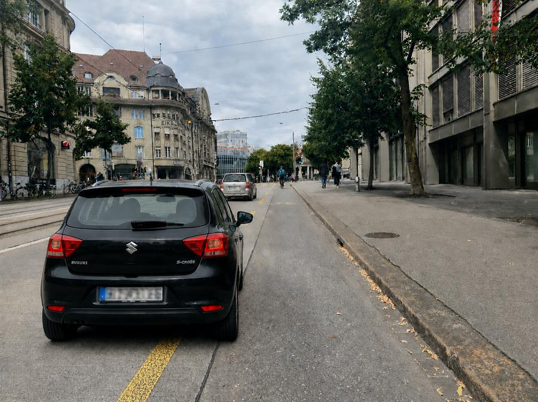 <code>o08d</code> Radstreifen 1,8 m, belegt · 38,6 %</td>
</tr></table>

Der Feel-Safe-Wert liegt beim teilweise befahrenen Radstreifen bei 38,6 % und damit nur geringfügig über jenem des Mischverkehrs bei gleicher Verkehrsmenge mit 34,7 %.

### 2.15 Exkurs: Subjektives Sicherheitsgefühl und Überholabstand
In der Umfrage werden Situationen mit einem 1,5 m breiten Radstreifen deutlich sicherer bewertet als Mischverkehr. Daraus lässt sich jedoch nicht ableiten, dass ein solcher Radstreifen auch zu grösseren Überholabständen führt. Messungen an der Bremgartenstrasse ermöglichen dazu eine ergänzende Betrachtung.

An der Bremgartenstrasse wurde 2025 in einer Fahrtrichtung ein 1,5 m breiter Radstreifen markiert und gleichzeitig die Mittellinie entfernt. Mithilfe eines OpenBikeSensors wurden die Überholabstände vor und nach der Anpassung gemessen. Der mediane Überholabstand nahm in beiden Fahrtrichtungen nahezu gleich stark zu.[^bremgarten-1]

[^bremgarten-1]: Auf der Seite mit Radstreifen um 17 cm, auf der gegenüberliegenden Seite ohne Radstreifen um 16 cm.

| Fahrtrichtung | Phase | Überholvorgänge | Median | Mittelwert | Unter 1,5 m | Unter 1,0 m |
|---|---|---:|---:|---:|---:|---:|
| Nordost, Radstreifen neu markiert | vorher | 137 | 0,94 m | 0,96 m | 95 % | 56 % |
| Nordost, Radstreifen neu markiert | nachher | 187 | 1,11 m | 1,13 m | 88 % | 34 % |
| Südwest, weiterhin ohne Radstreifen | vorher | 74 | 0,84 m | 0,84 m | 93 % | 62 % |
| Südwest, weiterhin ohne Radstreifen | nachher | 75 | 1,00 m | 1,06 m | 91 % | 47 % |

*Quelle: eigene Messungen mit einem OpenBikeSensor. Vorher: 211 Überholvorgänge auf 14 Fahrten vom 28.03.2025 bis 11.05.2025. Nachher: 262 Überholvorgänge auf 13 Fahrten vom 25.08.2025 bis 27.08.2025. Messbereich: 0,15–2,85 Meter, gemessen ab Lenkerende.*

Die nahezu gleiche Zunahme in beiden Fahrtrichtungen spricht dafür, dass auch die entfernte Mittellinie den Überholabstand beeinflusst haben könnte. Ein zusätzlicher Effekt des Radstreifens lässt sich anhand dieser Messung nicht nachweisen.

Auf der Seite mit Radstreifen sank der Anteil der Überholungen mit weniger als 1 m Abstand von 56 auf 34 %. Dennoch erfolgten auch nach der Markierung 88 % der Überholungen mit weniger als 1,5 m Abstand.

Eine mögliche Erklärung ist, dass sich Autofahrende beim Überholen an der Radstreifenlinie orientieren. Hinweise darauf liefert auch der Schlussbericht der OST zu Überholabständen in Schweizer Städten (Hagedorn et al., August 2026, im Auftrag des VCS). Für die Länggassstrasse beschreiben die Autorinnen und Autoren, dass sich Autofahrende beim Überholen an der Radstreifenmarkierung orientieren und nur stärker ausschwenken, wenn das Velo nahe an der Markierung fährt. Je weiter rechts das Velo fährt, desto grösser fällt der Überholabstand aus. Daraus leiten sie ab, dass möglichst breite Radstreifen sinnvoll sind, damit auch beim Fahren in der Streifenmitte genügend Abstand verbleibt.

Der Exkurs liefert Hinweise darauf, dass subjektives Sicherheitsgefühl und gemessener Überholabstand nicht dasselbe abbilden. Ein 1,5 m breiter Radstreifen kann das Sicherheitsgefühl gegenüber Mischverkehr deutlich verbessern, ohne dass sich daraus automatisch ein zusätzlicher Effekt auf den Überholabstand ergibt.

## 3 Fazit
Die Studie zeigt nicht nur, welche Führungsformen als sicherer empfunden werden, sondern auch, wie gross die Unterschiede in den untersuchten Situationen sind. Mit den Feel-Safe-Werten lassen sich Mischverkehr, Radstreifen und Radwege sowie unterschiedliche Radstreifenbreiten auf einer gemeinsamen Skala vergleichen.

1. **Wie stark ein 1,5 m breiter Radstreifen das subjektive Sicherheitsgefühl erhöht, hängt von der Strassensituation ab.** Auf ruhigen Strassen fällt der Unterschied gegenüber dem Mischverkehr deutlich aus: An der Laubeggstrasse steigt der Feel-Safe-Wert von 45 auf 89 %, an der Schwarzenburgstrasse von 42 auf 89 %. An der Standstrasse mit mittlerem Verkehrsaufkommen steigt er von 33 auf 69 %. Ein 1,5 m breiter Radstreifen an der Bolligenstrasse führt dagegen gegenüber dem Mischverkehr zu keiner statistisch nachweisbaren Steigerung des Sicherheitsgefühls[^mindestbreite-1].

   Bei viel Verkehr bleibt das Sicherheitsgefühl vergleichsweise tief: An der Freiburgstrasse erreicht der Feel-Safe-Wert mit Radstreifen 38 % gegenüber 16 % im Mischverkehr[^ort10-1]. Ohne Verkehr erreicht derselbe Radstreifen 71 %[^verkehr-5]. Dies zeigt, dass die Verkehrsmenge für die Bewertung eine wichtige Rolle spielt.

2. **Ein 1,8 m breiter Radstreifen wird über die drei untersuchten Orte hinweg als sicherer bewertet als ein 1,5 m breiter.** Werden die Bewertungen der drei Bildpaare zusammengefasst, liegt der Feel-Safe-Wert 5,7 Punkte höher[^breite-1]. Der 95-%-Vertrauensbereich reicht von +2,1 bis +9,4 Punkten. Am grössten ist der Unterschied an der Standstrasse mit mittlerem Verkehrsaufkommen: Dort beträgt er rund 21 Punkte, während er an den beiden Strassen mit wenig Verkehr bei rund 1 bis 5 Punkten liegt.

3. **Auch der Vergleich zwischen 1,5 und 2,0 m breiten Radstreifen zeigt einen Zugewinn an subjektiver Sicherheit.** Werden die Bewertungen der vier untersuchten Bildpaare zusammengefasst, liegt der Feel-Safe-Wert beim 2,0 m breiten Radstreifen 10,6 Punkte höher[^breite-2]. Der 95-%-Vertrauensbereich reicht von +5,3 bis +16,0 Punkten.

Die Radstreifenbreiten lassen sich auf Bildern am Bildschirm nur eingeschränkt einschätzen. Perspektive und Bildgrösse können beeinflussen, wie die dargestellten Breiten wahrgenommen und bewertet werden. Um die Ergebnisse der Bildumfrage zu überprüfen, wären deshalb ergänzende Befragungen sinnvoll. Velofahrende sollten ihr Sicherheitsgefühl unmittelbar nach dem Befahren derselben Strassenabschnitte beurteilen – jeweils vor und nach einer Verbreiterung des Radstreifens und bei möglichst vergleichbaren Verkehrsbedingungen. So liesse sich untersuchen, ob die anhand der Bilder festgestellten Unterschiede auch beim tatsächlichen Fahren auftreten.

## 4 Schluss
Der Strassencheck von FixMyCity mit Berliner Szenen und die Berner Umfrage zeigen dieselbe Reihenfolge: Radstreifen werden als sicherer empfunden als Mischverkehr, Radwege als sicherer als Radstreifen. Auch die Grössenordnung der Unterschiede ist vergleichbar: Zwischen Mischverkehr und Radstreifen liegen rund 35 bis 45 Feel-Safe-Punkte, zwischen Radstreifen und Radweg rund 20 bis 25 Punkte.

Weniger eindeutig ist, wie stark die Breite eines Radstreifens das Sicherheitsgefühl beeinflusst. Beide Befragungen weisen in dieselbe Richtung: Breitere Radstreifen werden als sicherer empfunden. Wie gross der Gewinn an subjektiver Sicherheit ist, lässt sich jedoch nur mit Unsicherheit abschätzen. Offen bleibt zudem, ob es eine Breite gibt, ab der zusätzlicher Platz das Sicherheitsgefühl nur noch wenig erhöht und vor allem den Komfort verbessert.

Unabhängig von diesen Ergebnissen spielt die Breite auch in meiner persönlichen Wahrnehmung eine Rolle. 30 Zentimeter können je nach Situation einen spürbaren Unterschied machen. Bei viel Verkehr fühle ich mich auf einem 1,8 m breiten Radstreifen deutlich sicherer als auf einem 1,5 m breiten. In der Abendspitze bei Tempo 50 geben mir 2,1 m nochmals mehr Sicherheit als 1,8 m.

> ## 5 Die Bewertungen im VeloroutenCheck
>
> Mit dem VeloroutenCheck lässt sich überprüfen, ob der Ist-Zustand des Veloroutennetzes der Stadt Bern den Vorgaben des Masterplans Veloinfrastruktur entspricht. Dies geschieht anhand des Erfüllungsgrads, der misst, wie nahe die subjektive Sicherheit der vorhandenen (Ist-)Form an jene herankommt, die die geforderte (Soll-)Form am selben Ort bieten würde. Der Rechner drückt diese Abweichung zunächst als Note von 1 bis 6 aus und übersetzt diese anschliessend in vier Kategorien des Erfüllungsgrads[^erfuellungsgrad].
>
> ### 5.1 Die Feel-Safe-Anker
>
> Aus den Feel-Safe-Werten der von FixMyCity durchgeführten «Strassencheck»-Erhebung wurden Referenzwerte für drei typische Führungsformen abgeleitet: die Feel-Safe-Anker. Sie geben Auskunft darüber, wie sicher sich Velofahrende im Mischverkehr, auf Radstreifen oder auf Radwegen fühlen. Die verwendeten Anker wurden aus einer Auswahl von Szenen je Führungsform abgeleitet. Dabei wurde zwischen Tempo ≤ 30 und Tempo > 30 unterschieden. Berücksichtigt wurden ausschliesslich Bewertungen aus der Velo-Perspektive[^perspektiven]. Diese Auswahl umfasste folgende Szenen:
>
> - Mischverkehr: Fahrbahn ohne parkierte Autos oder Schienen.
> - Radstreifen: 2,5 m breit, entsprechend der Sollbreite auf Velohauptrouten; Abweichungen von dieser Breite und eine Parkierung werden im Rechner separat abgezogen. Der Wert wurde linear zwischen den Berliner Bildern mit 2,0 und 3,5 m interpoliert; ohne Parkierung, auf grauem Belag und mit gestrichelter Führungslinie entsprechend dem Berner Markierungsbild.
> - Radweg: durch Sperrpfosten getrennt, bei Tempo > 30 zusätzlich im Seitenraum ohne Geschäftsnutzung im Nebenbereich.
>
> | Feel-Safe-Anker | ruhig (V ≤ 30) | schnell (V > 30) |
> |---|---:|---:|
> | Mischverkehr | 24 % | 13 % |
> | Radstreifen | 65 % | 58 % |
> | Radweg (baulich getrennt) | 90 % | 84 % |
>
> *Anker aus der FixMyCity-Studie (Strassencheck Berlin)*
>
> Im Mischverkehr bei Tempo 30 fühlen sich 24 % der befragten Personen «eher sicher» oder «sicher», auf einem Radstreifen 65 %. Der Abstand zwischen diesen beiden Ankern, 41 Feel-Safe-Punkte, ist das Mass für die Abweichung der subjektiven Sicherheit zwischen Mischverkehr und Radstreifen.
>
> ### 5.2 Von Punkten zu Noten
>
> Der grösstmögliche Unterschied im Feel-Safe-Wert bei einem Tempo von über 30 km/h zwischen Mischverkehr und Radweg soll der Note 1 entsprechen. Diese Soll-Ist-Abweichung beträgt 71 Punkte (84 − 13). Eine Notenstufe entspricht deshalb 71 ÷ 5 = 14,2 Punkten.
>
> Ein Beispiel: Für eine Strasse mit Tempo 30 und 4 000 Fahrzeugen pro Tag sieht der Masterplan Veloinfrastruktur der Stadt Bern einen Radstreifen vor. Fehlt dieser, fahren Velofahrende im Mischverkehr. Das Defizit beträgt in diesem Fall 65 − 24 = 41 Feel-Safe-Punkte. Dies entspricht einem Abzug von 2,9 Notenstufen und ergibt die Note 6 − 2,9 = 3,1. Auf halbe Noten gerundet resultiert die Note 3,0 und damit die Bewertung «Gar nicht erfüllt». Ist ein Radstreifen in der vom Masterplan geforderten Breite vorhanden, beträgt das Defizit null und die Note 6,0.
>
> ### 5.3 Der Abzug für fehlende Breite
>
> Der Radstreifen-Anker beschreibt einen 2,5 m breiten Streifen – die Breite, die der Masterplan auf Velohauptrouten vorsieht. Abgezogen wird allerdings nicht gegenüber dem Anker, sondern gegenüber der Breite, die am jeweiligen Ort gefordert ist: 2,5 m auf Velohauptrouten, 1,8 m auf Velorouten.
>
> Ist ein Radstreifen auf einer Veloroute nur 1,5 statt der geforderten 1,8 m breit, wird die Note entsprechend reduziert. Der Breitenabzug basiert auf acht Berliner Szenen des Strassenchecks. Für jede Tempoklasse (Tempo 30 und Tempo 50) wurden je zwei Bilder mit 2,0 und 3,5 m breiten Radstreifen ausgewertet. Abgesehen von der Breite sind die Bildpaare identisch. Bei Tempo 30 liegen für die beiden 2,0-m-Bilder zusammen 217 Bewertungen vor und für die 3,5-m-Bilder 218, bei Tempo 50 sind es 231 und 223. Der Abzug beruht damit auf insgesamt 889 Bewertungen.
>
> Bei Tempo 30 liegt der Feel-Safe-Wert der beiden 2,0 m breiten Radstreifen bei 60,8 %, jener der 3,5 m breiten bei 74,8 %. Bei Tempo 50 sind es 52,4 % und 68,2 %. Der Unterschied zwischen den beiden Breiten, 13,9 beziehungsweise 15,8 Punkte (aus den ungerundeten Feel-Safe-Werten berechnet), wird durch die Breitendifferenz von 1,5 m geteilt. Daraus ergeben sich je nach Tempoklasse 9,3 beziehungsweise 10,5 Feel-Safe-Punkte pro Meter.
>
> Bei 14,2 Punkten pro Notenstufe entspricht dies einem Abzug von 0,65 beziehungsweise 0,74 Notenstufen pro fehlendem Meter. Für fehlende 30 cm zieht der Rechner somit 0,20 beziehungsweise 0,22 Notenstufen ab. Beim obigen Beispiel mit Tempo 30 km/h sind es somit 0,20. Anhand der Daten aus der FixMyCity-Studie lässt sich eine Abweichung von 30 cm jedoch nur mit erheblicher Unsicherheit in einen Erfüllungsgrad übertragen[^breitenabzug].
>
> Die offene Frage ist deshalb: Wie soll der Rechner einen Radstreifen bewerten, der statt der geforderten 1,8 m nur 1,5 m breit ist?
>
> ### 5.4 Vergleich mit der Berner Umfrage
>
> **Berner Feel-Safe-Anker als zweite Quelle**
>
> Die Berner Umfrage liefert eine zweite Ankerbestimmung. Sie beruht auf 37 Szenen aus zehn der insgesamt 14 untersuchten Berner Strassenabschnitte[^anker-bewertungen] und unterscheidet nach Verkehrsmenge statt nach Tempo. «Viel Verkehr» steht dem Berliner «schnell» am nächsten, die übrigen Bilder mit keinem, wenig und mittlerem Verkehr dem Berliner «ruhig». Die Berner Radstreifen sind 1,5 bis 2,5 m breit, der Berliner Anker gilt für 2,5 m – die Sollbreite auf Velohauptrouten.
>
> Die Berliner Anker sind teilweise interpoliert: Der Radstreifen-Anker gilt für 2,5 m, gemessen wurden aber nur 2,0 und 3,5 m. Die Berner Werte fassen Bilder verschiedener Orte und Breiten zusammen. Der Vergleich ist deshalb eine Annäherung.
>
> | Feel-Safe-Anker | Bern, viel Verkehr | FixMyCity «schnell» | Bern, übrige (ohne, wenig, mittel) | FixMyCity «ruhig» |
> |---|---:|---:|---:|---:|
> | Mischverkehr | 32 % | 13 % | 47 % | 24 % |
> | Radstreifen | 67 % | 58 % | 80 % | 65 % |
> | Radweg-Klasse | 96 % | 84 % | 98 % | 90 % |
> | Spanne Mischverkehr → Radweg | 64 Punkte | 71 Punkte | 51 Punkte | 66 Punkte |
> | Punkte je Notenstufe (Spanne ÷ 5) | 12,7 | 14,2 | 10,2 | 13,2 |
>
> Die Rangfolge stimmt in beiden Untersuchungen überein, und der Radstreifen-Anker bei viel Verkehr (67 %) liegt nahe beim Berliner «schnell»-Wert (58 %). Alle Berner Anker liegen über den Berliner Werten[^anker-genauigkeit] - am grössten sind die Abstände beim Mischverkehr. Die Spanne zwischen Mischverkehr und Radweg ist deshalb in Bern kleiner und eine Notenstufe entspricht mit den Berner Ankern 10,2 Feel-Safe-Punkten (bei den Bildern ohne, mit wenig und mit mittlerem Verkehrsaufkommen) beziehungsweise 12,7 Punkten (bei viel Verkehr), statt 14,2 Feel-Safe-Punkten[^anker-rundung].
>
> Die Berner Umfrage ermöglicht eine Überprüfung des Breitenabzugs. Sie liefert zwei Schätzwerte: den Schritt von 1,5 auf 1,8 m (drei Bildpaare) und jenen von 1,5 auf 2,0 m (vier Bildpaare). Die Tabelle stellt sie den beiden Berliner Sätzen gegenüber, mit denen der VeloroutenCheck heute rechnet.
>
> | Grundlage | Breitenschritt | Unterschied | Punkte je Meter | Notenstufen je Meter | Abzug für 30 cm | Bewertungen |
> |---|---|---:|---:|---:|---:|---:|
> | Berlin, zwei Bildpaare, Tempo ≤ 30 | 2,0 → 3,5 m | 13,9 Punkte | 9,3 | 0,65 | 0,20 | 435 |
> | Berlin, zwei Bildpaare, Tempo > 30 | 2,0 → 3,5 m | 15,8 Punkte | 10,5 | 0,74 | 0,22 | 454 |
> | Bern, drei Bildpaare | 1,5 → 1,8 m | 5,7 Punkte | 18,9 | 1,33 (0,50 … 2,20) | 0,40 (0,15 … 0,66) | 948 |
> | Bern, vier Bildpaare | 1,5 → 2,0 m | 10,6 Punkte | 21,2 | 1,49 (0,74 … 2,25) | 0,45 (0,22 … 0,67) | 938 |
> | **alle vier Werte zusammen**[^abhaengig] | 1,5 bis 3,5 m | – | **15,0** | **1,05** | **0,32** | 2 775 |
>
> *Umrechnung mit 14,2 Feel-Safe-Punkten je Notenstufe, dem Kurs des Rechners – nur so sind die Werte mit den heutigen Abzügen vergleichbar.*
>
> Der Berner Schätzwert für den Schritt auf 1,8 m liegt damit rund doppelt so hoch wie die Berliner Sätze. Der zweite Schätzwert, aus dem Schritt auf 2,0 m, stützt die Grössenordnung des ersten Werts.
>
> Die Werte beschreiben allerdings unterschiedliche Breitenbereiche: Der Berliner Wert wurde zwischen 2,0 und 3,5 m ermittelt, die Berner Werte zwischen 1,5 und 2,0 m. Ob zusätzliche Breite bei schmalen Streifen mehr bewirkt als bei breiten, lässt sich durch die Umfrage nicht beantworten. Beide Berner Schätzwerte liegen über den Berliner Werten. Beim Schritt von 1,5 auf 1,8 m liegen beide Berliner Abzugssätze innerhalb des Berner Vertrauensbereichs (0,50 bis 2,20 Notenstufen je Meter). Beim Schritt von 1,5 auf 2,0 m liegt die Untergrenze höher (0,74 Notenstufen je Meter): Der Berliner Satz von 0,65 liegt ausserhalb, jener von 0,74 noch innerhalb. Das widerlegt den Berliner Abzug nicht — auch er ist eine Schätzung mit eigener Unsicherheit.
>
> Die Notenskala und der Breitenabzug sind zwei getrennte Bausteine. Die Skala ergibt sich aus den Ankern: Die Spanne von 71 Punkten zwischen Mischverkehr und Radweg bei Tempo > 30 entspricht fünf Notenstufen, eine Stufe also 14,2 Punkten. Der Abzug je Meter ist dagegen eine eigene Messung - er kann aus den Berliner Bildern, aus der Berner Umfrage oder aus beiden zusammen stammen. Beide Erhebungen messen denselben Anteil «eher sicher» oder «sicher» – ein Berner Punkt wiegt deshalb gleich viel wie ein Berliner. Solange die Anker aus Berlin stammen, wird auch ein Berner Abzug mit 14,2 Punkten je Notenstufe umgerechnet. Ein Wechsel auf die Berner Skala müsste Anker und Abzug gemeinsam erfassen: Der Abzug läge dann bei 1,85 beziehungsweise 2,07 Notenstufen je Meter.
>
> Würden beide Quellen zusammengeführt, ergäbe der Durchschnitt der vier Werte 1,05 Notenstufen je Meter. Eine Unterscheidung nach Tempo lässt sich daraus nicht ableiten: Die Berner Umfrage fragt nach der Verkehrsmenge, und bei viel Verkehr liegt nur ein Bildpaar vor. Der Bericht setzt deshalb als vorläufige Kalibrierung 1,0 Notenstufen je Meter für beide Tempoklassen an — für 30 cm 0,30 statt der heutigen 0,20 und 0,22, rund 44 % mehr Abzug (siehe «Konsequenzen für den VeloroutenCheck»).
>
> | Abzug für fehlende Breite | heute | vorläufige Kalibrierung |
> |---|---:|---:|
> | Tempo ≤ 30, je Meter | 0,65 | 1,00 |
> | Tempo > 30, je Meter | 0,74 | 1,00 |
> | für 30 cm, beide Tempoklassen | 0,20 / 0,22 | 0,30 |
>
> ### 5.5 Konsequenzen für den VeloroutenCheck
>
> Der VeloroutenCheck rechnet weiterhin mit den Berliner Ankern und 14,2 Punkten je Notenstufe.
>
> | | Berlin, Tempo ≤ 30 | Berlin, Tempo > 30 | Bern, übrige | Bern, viel Verkehr |
> |---|---:|---:|---:|---:|
> | Anker Mischverkehr | 24 % | 13 % | 47 % | 32 % |
> | Anker Radstreifen | 65 % | 58 % | 80 % | 67 % |
> | Anker Radweg-Klasse | 90 % | 84 % | 98 % | 96 % |
> | Spanne Mischverkehr → Radweg | 66 Punkte | 71 Punkte | 51 Punkte | 64 Punkte |
> | Punkte je Notenstufe (Spanne ÷ 5) | 13,2 | 14,2 | 10,2 | 12,7 |
> | Breiteneffekt (Punkte je Meter) | 9,3 | 10,5 | 22,0 | 16,9 |
> | Abzug je Meter, Kurs des Rechners (14,2) | **0,65** | **0,74** | **1,55** | **1,19** |
> | Abzug für 30 cm, Kurs des Rechners | **0,20** | **0,22** | **0,47** | **0,36** |
> | Abzug je Meter, Kurs der eigenen Spalte | 0,70 | 0,74 | 2,15 | 1,32 |
>
> *Berliner Anker und Breiteneffekte wie im Rechner hinterlegt (2,0 → 3,5 m); Berner Werte aus dieser Umfrage. Der Berner Breiteneffekt der übrigen Bilder ist das Mittel der beiden Schritte 1,5 → 1,8 m (18,9) und 1,5 → 2,0 m (25,1 Punkte je Meter), jener bei viel Verkehr stammt aus einem Bildpaar. Der Rechner verwendet für beide Tempoklassen denselben Kurs von 14,2 Punkten; mit dem Kurs der eigenen Spalte ergäbe sich bei Tempo ≤ 30 ein Abzug von 0,70 statt 0,65 Notenstufen je Meter.*
>
> **Wie hoch der Breitenabzug im VeloroutenCheck sein sollte, bleibt unsicher.** Der geschätzte Unterschied von 5,7 Punkten für 30 cm mehr Breite hat einen 95-%-Vertrauensbereich von +2,1 bis +9,4 Punkten. Bei 14,2 Punkten pro Notenstufe entspricht dies rund 0,15 bis 0,66 Notenstufen. Auf einen Meter umgerechnet ergibt die Auswertung einen Schätzwert von 1,33 Notenstufen mit einem Vertrauensbereich von 0,50 bis 2,20. Der Schritt von 1,5 auf 2,0 m ergibt einen zweiten Schätzwert von 1,49 Notenstufen je Meter mit einem Vertrauensbereich von 0,74 bis 2,25. Beide Schätzwerte liegen über den bisherigen Berliner Abzügen von 0,65 beziehungsweise 0,74 Notenstufen je Meter.
>
> Die Berliner Abzüge beruhen auf dem Breitenvergleich zwischen 2,0 und 3,5 m und werden unter Annahme eines linearen Zusammenhangs auf schmalere Radstreifen übertragen. Die Berner Umfrage untersucht dagegen unmittelbar den Bereich zwischen 1,5 und 2,0 m. Ihre Ergebnisse sprechen für einen höheren Abzug in diesem Bereich. Ob zusätzliche Breite bei schmalen Streifen grundsätzlich mehr bewirkt als bei breiten, lässt sich damit jedoch nicht belegen.
>
> **Als vorläufiger Breitenabzug wird 1,0 Notenstufe pro fehlendem Meter angesetzt.** Zur Orientierung dienen die beiden Berliner Schätzwerte von 0,65 und 0,74 sowie die beiden Berner Schätzwerte von 1,33 und 1,49 Notenstufen je Meter. Ihr einfacher Durchschnitt beträgt rund 1,05 und wird für den Rechner auf 1,0 gerundet. Damit liegt der gewählte Abzug zwischen den niedrigeren Berliner und den höheren Berner Schätzwerten. Dafür spricht auch eine zweite Überlegung: Die höchste Untergrenze der vier Vertrauensbereiche liegt bei 0,74, die tiefste Obergrenze bei 1,05 Notenstufen je Meter. Nur Werte dazwischen widersprechen keiner der vier Messungen - die heutigen 0,65 liegen knapp darunter, die Berner Schätzwerte deutlich darüber.
>
> Diese Mittelung gewichtet die vier Schätzwerte gleich, ohne ihre unterschiedliche Unsicherheit zu berücksichtigen. Zudem verwenden die beiden Berner Auswertungen teilweise dieselben Bewertungen[^abhaengig]. Der Abzug von 1,0 ist deshalb als vorläufige Festlegung für den Rechner zu verstehen; ein statistisch abgesicherter gemeinsamer Wert lässt sich daraus nicht ableiten.
>
> Der Abzug bezieht sich weiterhin auf die am jeweiligen Ort geforderte Breite. Für einen Radstreifen mit 1,5 statt 1,8 m beträgt er damit 0,30 Notenstufen statt bisher 0,20 beziehungsweise 0,22; die Note eines sonst einwandfreien Abschnitts sinkt von 5,8 auf 5,7, gerundet von 6,0 auf 5,5, und bleibt im Erfüllungsgrad «Vollständig erfüllt». Die Berliner Feel-Safe-Anker und die Umrechnung mit 14,2 Punkten pro Notenstufe bleiben bestehen. Im Rechner ist dieser Wert noch nicht hinterlegt; er verwendet weiterhin 0,65 und 0,74 Notenstufen je Meter. Für Radstreifen, die deutlich schmaler sind als die untersuchten 1,5 m, ist auch diese lineare Regel nicht durch die vorliegenden Vergleiche abgesichert.
>
> **Der vorläufige Abzug gilt für beide Tempoklassen.** Die Berner Umfrage unterscheidet nach Verkehrsmenge und nicht nach Tempo; sie liefert deshalb keine Grundlage für getrennte Abzüge. Weiter zu untersuchen ist, wie stark die Verkehrsmenge den Breiteneffekt beeinflusst und ob der Abzug je Meter bei schmalen Streifen höher anzusetzen ist als bei breiten. Dafür wären zusätzliche Bildpaare bei viel Verkehr und an denselben Orten auch für Breiten über 2,0 m sowie Befragungen vor und nach realen Verbreiterungen sinnvoll.
>
> ### 5.6 Was der VeloroutenCheck leisten kann
>
> Der VeloroutenCheck soll Abweichungen von den Vorgaben des Masterplans nachvollziehbar in Noten und einen Erfüllungsgrad übersetzen. Die gemachten Berechnungen sollen keine Genauigkeit vortäuschen, die nicht geleistet werden kann, insbesondere da die hinterlegten Werte das Sicherheitsempfinden einzelner Velofahrender unterschiedlich gut abbilden können.
>
> Der Rechner macht dennoch sichtbar, wo Strassenzüge und Routenabschnitte die planerisch festgelegten Standards erfüllen und wo sie davon abweichen. Damit bietet er eine Grundlage, um Abweichungen zu vergleichen.

[^perspektiven]: Der Strassencheck zeigte die Szenen aus drei Perspektiven: aus Sicht der Velofahrenden, der Autofahrenden und der Zufussgehenden. Für die Anker zählen nur die Bilder aus der Velo-Perspektive.

[^erfuellungsgrad]: Note 6 heisst, die vorhandene Form bietet dasselbe Sicherheitsgefühl wie die geforderte, Note 1 den grösstmöglichen Abstand. Gerundet wird einmal am Schluss auf halbe Noten, danach gilt: 5,5 bis 6,0 «Vollständig erfüllt», 4,5 bis 5,0 «Weitgehend erfüllt», 3,5 bis 4,0 «Teilweise erfüllt», 3,0 und tiefer «Gar nicht erfüllt».

[^abhaengig]: Das Bild der Standstrasse mit 1,5 m Radstreifen bei mittlerem Verkehr (74 Bewertungen) geht in beide Vergleiche ein, und 544 Fragebögen tragen zu beiden bei. Die beiden Schätzwerte sind deshalb keine unabhängigen Belege.

[^anker-bewertungen]: Die Berner Anker beruhen je Zelle auf 253 bis 2 103 Bewertungen.

[^anker-genauigkeit]: Die 95-%-Vertrauensbereiche der Berner Anker betragen ±2 bis ±8 Punkte, am breitesten bei «viel Verkehr, Mischverkehr» (32 % ±8).

[^anker-rundung]: Spanne und Punkte je Notenstufe sind aus den ungerundeten Ankerwerten berechnet; die Tabelle zeigt gerundete Werte.

[^breitenabzug]: **Die acht Szenen:** Tempo 30 – [2,0 m](https://radwege-check.de/hauptstrassen/ms-c-10/), [2,0 m](https://radwege-check.de/hauptstrassen/ms-c-12/), [3,5 m](https://radwege-check.de/hauptstrassen/ms-c-298/), [3,5 m](https://radwege-check.de/hauptstrassen/ms-c-300/); Tempo 50 – [2,0 m](https://radwege-check.de/hauptstrassen/ms-c-9/), [2,0 m](https://radwege-check.de/hauptstrassen/ms-c-11/), [3,5 m](https://radwege-check.de/hauptstrassen/ms-c-297/), [3,5 m](https://radwege-check.de/hauptstrassen/ms-c-299/). **Was 0,65 und 0,74 sind:** der aus dem Unterschied zwischen den 2,0-m- und den 3,5-m-Bildern abgeleitete Abzug je Meter, umgerechnet in Notenstufen. Es ist der wahrscheinlichste Wert aus den vorhandenen Bewertungen; der Rechner verwendet ihn, als wäre er exakt. **Woher die Unsicherheit kommt:** Jede Zelle beruht auf nur zwei Bildern, und kein Bild zeigt 1,5 oder 1,8 m – die zwischen 2,0 und 3,5 m gemessene Gerade wird nach unten verlängert. Der 95-%-Vertrauensbereich reicht von 0,24 bis 1,05 Noten je Meter bei Tempo ≤ 30 und von 0,32 bis 1,15 bei Tempo > 30. Dass die Breite wirkt, ist damit belegt; wie stark, bleibt offen – der Abzug könnte rund 40 % oder 160 % des heutigen Werts betragen. **Was das für die Note bedeutet:** Ein sonst einwandfreier Radstreifen mit 1,5 statt 1,8 m erhält heute die Note 5,8, gerundet 6,0. Am oberen Rand des Berliner Bereichs wären es 5,7, am oberen Rand des Berner Bereichs (2,2 Noten je Meter) 5,3 – gerundet in beiden Fällen 5,5. Der Erfüllungsgrad bleibt in allen drei Fällen «Vollständig erfüllt».

## 6 Statistik und Lesart der Fussnoten
### 6.1 Lesart der Fussnoten
Die Fussnoten nennen die Befundstufe, den Vergleich und den Unterschied der Feel-Safe-Werte. In Klammern folgt der 95-%-Vertrauensbereich, danach die Anzahl Bewertungen: zuerst für die Vergleichsbasis, dann für die verglichene Variante.

Ein positiver Unterschied bedeutet, dass die Variante besser bewertet wurde als die Vergleichsbasis, ein negativer Unterschied eine schlechtere Bewertung. Die Unterschiede und ihre Vertrauensbereiche werden in Feel-Safe-Punkten angegeben; ein Punkt entspricht einem Prozentpunkt.

Bei zusammengefassten Vergleichen umfassen die Bewertungszahlen alle Bilder der jeweiligen Vergleichsgruppe. Die Fussnote zu den Feel-Safe-Ankern nennt zusätzlich zu den Unterschieden zwischen den Führungsformen auch die statistische Unsicherheit jedes einzelnen Ankerwerts.

### 6.2 Unsicherheit der Werte
Jeder Feel-Safe-Wert beruht auf einer begrenzten Zahl von Bewertungen. Wären andere Personen befragt worden, wären die Werte anders ausgefallen. Der 95-%-Vertrauensbereich beschreibt diese statistische Unsicherheit.

Unter den Annahmen des jeweiligen Verfahrens würden bei wiederholten Erhebungen unter gleichen Bedingungen langfristig rund 95 % der berechneten Bereiche den wahren Wert einschliessen. Das bedeutet nicht, dass der wahre Wert mit 95 % Wahrscheinlichkeit im konkret berechneten Bereich liegt. Verzerrungen durch die Auswahl der Befragten oder der Bilder werden damit ebenfalls nicht erfasst.

Innerhalb eines Fragebogens wurde höchstens eine Variante desselben Strassenabschnitts gezeigt. Einzelne Bildpaare werden deshalb als unabhängige Stichproben ausgewertet. Bei Vergleichen über mehrere Orte kann dagegen ein Fragebogen zu beiden Vergleichsgruppen beitragen. Dafür wird ein Verfahren verwendet, das die zusammengehörenden Antworten berücksichtigt. Beide Berechnungswege werden nachfolgend erläutert. Mögliche Mehrfachteilnahmen derselben Person lassen sich bei keinem der beiden Verfahren erkennen.

Alle Berechnungen und Einstufungen erfolgen mit ungerundeten Werten. Die dargestellten Zahlen sind gerundet. Beim Nachrechnen können deshalb kleine Abweichungen entstehen.

### 6.3 Rechenbeispiel 1: Der Vertrauensbereich eines Bildpaars
Am Vergleich zwischen Kaphaltestelle und Haltestellenumfahrung lässt sich die Berechnung in zwei Schritten zeigen. Zuerst wird für jedes Bild ein Vertrauensbereich mit dem Wilson-Verfahren berechnet. Anschliessend werden die beiden Bereiche mit dem Newcombe-Verfahren zum Vertrauensbereich des Unterschieds kombiniert.

**Schritt 1: Bereich je Bild**

Für die Kaphaltestelle liegen 99 Bewertungen vor, davon 11 «eher sicher» oder «sicher». Für die Umfahrung sind es 105 Bewertungen, davon 101 positiv. Die Feel-Safe-Werte betragen somit 11,1 beziehungsweise 96,2 %.

Eine einfache Näherungsformel für den 95-%-Vertrauensbereich eines beobachteten Anteils $p$ aus $n$ Bewertungen lautet:

$$p \pm 1{,}96 \cdot \sqrt{\frac{p\,(1-p)}{n}}$$

Bei kleinen Stichproben und Anteilen nahe 0 oder 100 % kann diese Formel unzuverlässige Bereiche liefern. Für die Umfahrung ergäbe sie 92,5 bis 99,9 %. Beim Bild mit dem höchsten Feel-Safe-Wert – 126 positive von 127 Bewertungen, also 99,2 % – läge die Obergrenze sogar bei 100,7 %.

Das hier verwendete Wilson-Verfahren hält beide Grenzen zwischen 0 und 100 %. Sein Bereich ist bei hohen Anteilen nach unten und bei niedrigen Anteilen nach oben weiter geöffnet. Dadurch liegt seine Mitte näher bei 50 % als der beobachtete Anteil. Der gemessene Feel-Safe-Wert selbst bleibt unverändert.

| | Kaphaltestelle | Umfahrung |
|---|---:|---:|
| positive Bewertungen $x$ | 11 | 101 |
| Bewertungen $n$ | 99 | 105 |
| Feel-Safe $p = x \div n$ | 11,1 % | 96,2 % |
| Mitte des Bereichs $= (p + 1{,}92 \div n) \div (1 + 3{,}84 \div n)$ | 12,6 % | 94,6 % |
| halbe Breite $= 1{,}96 \div (1 + 3{,}84 \div n) \cdot \sqrt{p\,(1-p) \div n + 0{,}96 \div n^2}$ | 6,2 | 3,9 |
| Bereich = Mitte ± halbe Breite | 6,3 … 18,8 % | 90,6 … 98,5 % |

Der Faktor 1,96 entspricht dem zweiseitigen 95-%-Bereich der Standardnormalverteilung. Die Zahlen 3,84, 1,92 und 0,96 sind gerundete Werte seines Quadrats, dessen Hälfte und dessen Viertels; gerechnet wird mit 3,8416, 1,9208 und 0,9604.

In den Formeln wird $p$ als Anteil zwischen 0 und 1 eingesetzt. Für die Darstellung werden die Ergebnisse mit 100 multipliziert: Die Mitte und die Grenzen stehen in Prozent, die halbe Breite in Prozentpunkten.

**Schritt 2: Bereich des Unterschieds**

Der Feel-Safe-Wert der Umfahrung liegt um 85,1 Punkte über dem der Kaphaltestelle. Für den Vertrauensbereich dieses Unterschieds werden zunächst die Abstände der beiden Werte zu ihren jeweiligen Intervallgrenzen bestimmt. Alle Angaben in der folgenden Tabelle sind Prozentpunkte:

| Abstand | Umfahrung | Kaphaltestelle |
|---|---:|---:|
| Nach unten: Wert minus untere Grenze | 96,2 − 90,6 = 5,6 | 11,1 − 6,3 = 4,8 |
| Nach oben: obere Grenze minus Wert | 98,5 − 96,2 = 2,3 | 18,8 − 11,1 = 7,7 |

Für die **untere Grenze** werden die Richtungen kombiniert, die den Unterschied verkleinern: Umfahrung nach unten und Kaphaltestelle nach oben. Das Newcombe-Verfahren verwendet dafür die Wurzel aus der Summe der quadrierten Abstände:

$$85{,}1-\sqrt{5{,}6^2+7{,}7^2}\approx85{,}1-9{,}5=\mathbf{+75{,}6}$$

Für die **obere Grenze** zählen die entgegengesetzten Richtungen: Umfahrung nach oben und Kaphaltestelle nach unten.

$$85{,}1+\sqrt{2{,}3^2+4{,}8^2}\approx85{,}1+5{,}3=\mathbf{+90{,}4}$$

Der Unterschied beträgt somit **+85,1 Punkte**, bei einem **95-%-Vertrauensbereich von +75,6 bis +90,4 Punkten**. Da der gesamte Bereich über null liegt, lautet die Einstufung **«Verbesserung belegt»**.

### 6.4 Rechenbeispiel 2: Der Vertrauensbereich einer zusammengefassten Auswertung
Der Vergleich zwischen 1,5 und 1,8 m breiten Radstreifen umfasst Bildpaare von der Standstrasse, der Schwarzenburgstrasse und der Laubeggstrasse.

**Der Schätzwert**

Die Bewertungen werden für jede Breite zusammengefasst. Aus den beiden Anteilen ergibt sich der Unterschied:

| | «eher sicher» oder «sicher» | Bewertungen | Feel-Safe |
|---|---:|---:|---:|
| 1,5 m, drei Bilder | 430 | 501 | 85,8 % |
| 1,8 m, drei Bilder | 409 | 447 | 91,5 % |
| Unterschied | | | +5,7 Punkte |

**Der Vertrauensbereich**

Für die Berechnung wird ein Personen-Bootstrap verwendet. Aus den 631 Fragebögen werden zufällig 631 gezogen, mit Zurücklegen: Ein Fragebogen kann mehrfach vorkommen, ein anderer gar nicht. Für jede so gebildete Stichprobe wird der Unterschied erneut berechnet. Gezogen werden ganze Fragebögen, damit die darin enthaltenen Bewertungen zusammenbleiben.

Die ersten fünf von insgesamt 2 000 Ziehungen ergeben:

| Ziehung | 1,5 m | 1,8 m | Unterschied |
|---:|---:|---:|---:|
| 1 | 86,2 % | 91,5 % | +5,2 |
| 2 | 85,6 % | 92,5 % | +6,9 |
| 3 | 88,6 % | 93,1 % | +4,5 |
| 4 | 88,1 % | 89,5 % | +1,4 |
| 5 | 86,5 % | 94,2 % | +7,7 |

Die 2 000 Unterschiede werden der Grösse nach sortiert. An beiden Enden werden die äussersten 2,5 % abgeschnitten. Der 51. Wert beträgt +2,1, der 1 950. Wert +9,4 Punkte. Zwischen diesen beiden Grenzen liegen die mittleren 95 % der Ziehungen.

Der geschätzte Unterschied beträgt damit **+5,7 Punkte**, bei einem **95-%-Vertrauensbereich von +2,1 bis +9,4 Punkten**. Auch hier liegt der gesamte Bereich über null: **«Verbesserung belegt»**.

### 6.5 Einstufung der Befunde
Die Befundstufe richtet sich nach der Lage des 95-%-Vertrauensbereichs zur Null:

- **Verbesserung belegt:** Der gesamte Bereich liegt über null.
- **Verschlechterung belegt:** Der gesamte Bereich liegt unter null.
- **Unterschied nicht nachgewiesen:** Der Bereich enthält null. Das bedeutet nicht, dass die Varianten gleichwertig sind.

«Belegt» bedeutet statistisch nachgewiesen, nicht automatisch «planerisch wichtig». Eine feste Relevanzschwelle wird nicht verwendet, da sich für diese Umfrage keine ausreichend begründete Grenze bestimmen liess. Die Grösse und Unsicherheit eines Unterschieds müssen deshalb anhand des Schätzwerts und seines Vertrauensbereichs beurteilt werden.

Die Bereiche gelten jeweils für den einzelnen Vergleich. Wenn tatsächlich kein Unterschied besteht, kann ein Verfahren mit einem 95-%-Vertrauensbereich unter seinen Annahmen in ungefähr 5 % der Fälle dennoch einen Unterschied anzeigen. Bei 27 Vergleichen wäre daher auch ohne tatsächliche Unterschiede im Durchschnitt etwa ein zufällig «belegter» Befund zu erwarten.

Der Bericht verwendet keine Korrektur für die Anzahl der Vergleiche. Die Befunde sind deshalb im Zusammenhang zu betrachten. Die Vergleiche waren durch die Bildauswahl vor der Erhebung festgelegt; die Bildpaare wurden überwiegend so gestaltet, dass jeweils ein Merkmal verändert wurde. Ausnahmen und Einschränkungen werden beim jeweiligen Vergleich erläutert.

### 6.6 Alle Vergleiche im Überblick
Die folgende Tabelle fasst die 27 Vergleiche zusammen. «Basis» bezeichnet die Vergleichsbasis, «Variante» die damit verglichene Ausführung. Zu jedem Bild sind der Bildcode und der Feel-Safe-Wert angegeben.

Alle 27 Vergleiche. «Basis» ist die Vergleichsbasis, «Variante» die verglichene Variante. Bei jedem Bild stehen der Bildcode und der Feel-Safe-Wert.

| Ort | Vergleich | Basis | Variante | Befund | Unterschied | 95-%-Bereich | Bewertungen Basis / Variante |
|---|---|---|---|---|---:|---:|---:|
| Haltestelle Wander | Umfahrung statt Kaphaltestelle[^haltestelle-1] |  o12a 11,1 % |  o12b 96,2 % | Verbesserung belegt | +85,1 | +75,6 … +90,4 | 99 / 105 |
| Schwarzenburgstrasse | Radstreifen 1,5 m statt Mischverkehr[^ort4-1] |  o04b 42,1 % |  o04a 88,8 % | Verbesserung belegt | +46,6 | +37,4 … +54,9 | 159 / 205 |
| Laubeggstrasse | Radstreifen 1,5 m statt Mischverkehr[^ort9-1] |  o09a 44,5 % |  o09c 88,7 % | Verbesserung belegt | +44,2 | +34,3 … +53,2 | 128 / 222 |
| Freiburgstrasse | Radstreifen 1,5 m statt Mischverkehr bei viel Verkehr[^ort10-1] |  o10a 15,6 % |  o10b 37,8 % | Verbesserung belegt | +22,1 | +8,1 … +34,2 | 64 / 98 |
| Bolligenstrasse | Radstreifen 2,0 m statt Mischverkehr[^mindestbreite-2] |  o01a 31,9 % |  o01c 53,3 % | Verbesserung belegt | +21,5 | +11,0 … +31,2 | 135 / 225 |
| Standstrasse · mittlerer Verkehr | 1,8 m statt 1,5 m[^ort2m-2] | <a href="Bilder/o02g.jpg">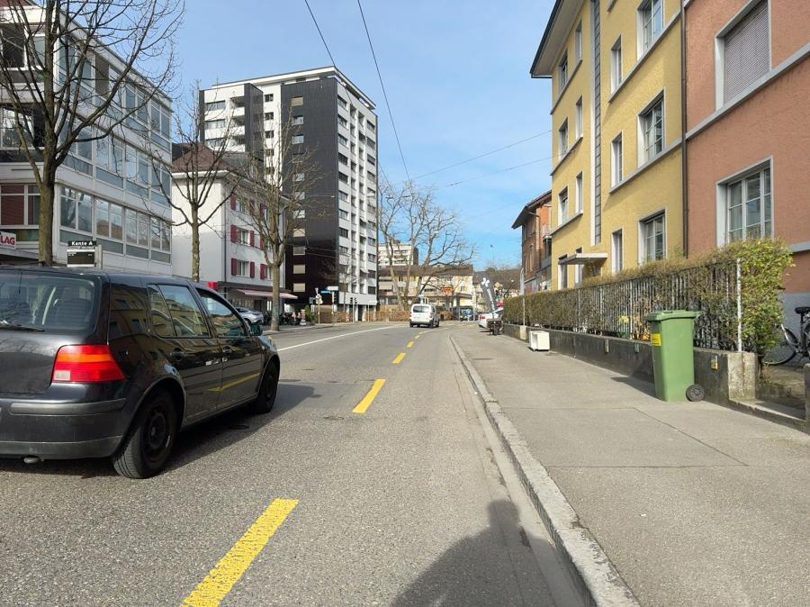</a> o02g 68,9 % | <a href="Bilder/o02f.jpg">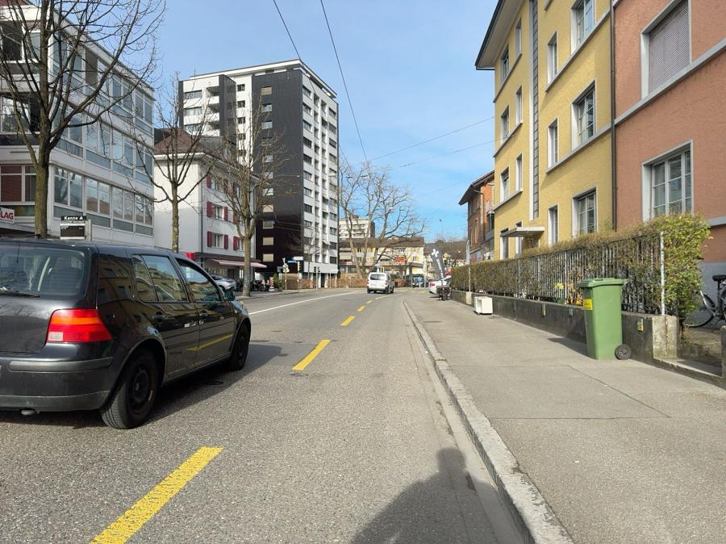</a> o02f 90,0 % | Verbesserung belegt | +21,1 | +7,9 … +33,4 | 74 / 70 |
| Schlossstrasse | Radstreifen statt Mischverkehr neben dem Mittelgleis[^schienen-2] |  o06e 56,1 % |  o06d 76,5 % | Verbesserung belegt | +20,4 | +5,1 … +35,2 | 57 / 98 |
| Bolligenstrasse | 2,0 m statt 1,5 m[^mindestbreite-3] |  o01b 34,1 % |  o01c 53,3 % | Verbesserung belegt | +19,3 | +9,6 … +28,4 | 182 / 225 |
| Standstrasse · mittlerer Verkehr | 2,0 m statt 1,5 m[^ort2m-4] |  o02g 68,9 % | <a href="Bilder/o02h.jpg">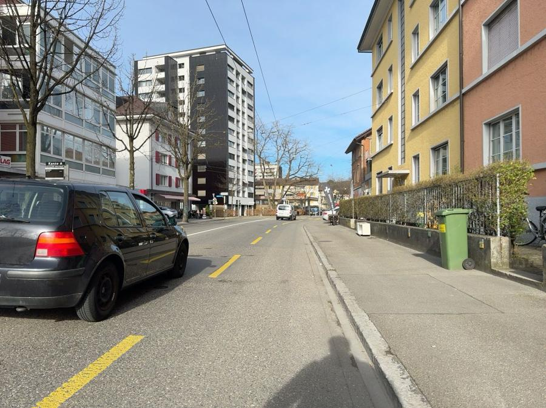</a> o02h 86,4 % | Verbesserung belegt | +17,5 | +4,4 … +30,2 | 74 / 81 |
| Bolligenstrasse, Standstrasse, Standstrasse und Schosshaldenstrasse | 2,0 m statt 1,5 m, vier Bildpaare zusammen[^breite-2] |    <a href="Bilder/o05a.jpg">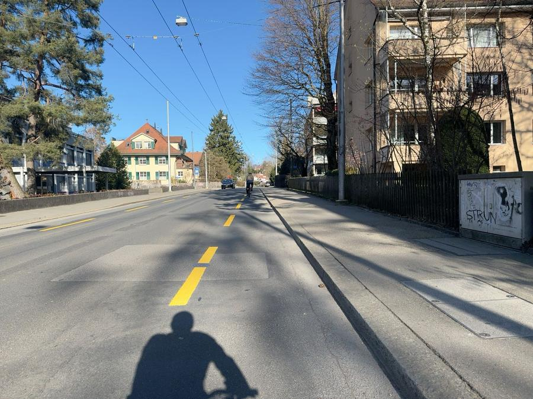</a> o01b 34,1 % · o02c 80,5 % · o02g 68,9 % · o05a 85,0 % |     o01c 53,3 % · o02d 88,9 % · o02h 86,4 % · o05c 88,5 % | Verbesserung belegt | +10,6 | +5,3 … +16,0 | 456 / 482 |
| Länggassstrasse | Abweislinie an der Länggassstrasse[^abweislinie-2] |  o03b 46,2 % |  o03a 55,2 % | Unterschied nicht nachgewiesen | +9,1 | −2,2 … +20,0 | 169 / 134 |
| Standstrasse · viel Verkehr | 2,0 m statt 1,5 m[^ort2v-4] |  o02c 80,5 % |  o02d 88,9 % | Unterschied nicht nachgewiesen | +8,4 | −3,8 … +19,5 | 87 / 63 |
| Laubegg-, Schwarzenburg- und Standstrasse | 1,8 m statt 1,5 m, drei Bildpaare zusammen[^breite-1] |    o02g 68,9 % · o04a 88,8 % · o09c 88,7 % |    o02f 90,0 % · o04c 89,9 % · o09b 93,5 % | Verbesserung belegt | +5,7 | +2,1 … +9,4 | 501 / 447 |
| Laubeggstrasse | 1,8 m statt 1,5 m[^ort9-2] |  o09c 88,7 % |  o09b 93,5 % | Unterschied nicht nachgewiesen | +4,7 | −0,8 … +10,3 | 222 / 199 |
| Schosshaldenstrasse | 2,0 m statt 1,5 m[^ort5-2] |  o05a 85,0 % |  o05c 88,5 % | Unterschied nicht nachgewiesen | +3,5 | −5,5 … +12,6 | 113 / 113 |
| Lorrainebrücke | Geschützter Radstreifen, ohne statt viel Verkehr[^verkehr-1] |  o14b 94,3 % |  o14a 97,1 % | Unterschied nicht nachgewiesen | +2,8 | −3,2 … +8,3 | 140 / 103 |
| Bolligenstrasse | Radstreifen 1,5 m statt Mischverkehr[^mindestbreite-1] |  o01a 31,9 % |  o01b 34,1 % | Unterschied nicht nachgewiesen | +2,2 | −8,3 … +12,4 | 135 / 182 |
| Schwarzenburgstrasse | 1,8 m statt 1,5 m[^ort4-2] |  o04a 88,8 % |  o04c 89,9 % | Unterschied nicht nachgewiesen | +1,1 | −5,3 … +7,3 | 205 / 178 |
| Winkelriedstrasse | Radweg, ohne statt viel Verkehr[^verkehr-2] |  o15b 98,2 % |  o15a 97,7 % | Unterschied nicht nachgewiesen | −0,6 | −5,0 … +4,1 | 114 / 129 |
| Marienstrasse | Parkierung links statt keine[^parkierung-1] |  o13a 93,2 % |  o13b 83,0 % | Verschlechterung belegt | −10,2 | −19,6 … −1,5 | 117 / 94 |
| Fabrikstrasse | Abweislinie an der Fabrikstrasse[^abweislinie-1] |  o11a 67,5 % |  o11b 55,1 % | Verschlechterung belegt | −12,4 | −22,3 … −2,1 | 169 / 178 |
| Monbijoustrasse | Mischverkehr, wenig statt ohne Verkehr[^verkehr-3] |  o08c 64,6 % |  o08b 52,1 % | Unterschied nicht nachgewiesen | −12,6 | −27,3 … +2,9 | 82 / 73 |
| Schlossstrasse | Radstreifen 1,5 m mit Schienen in der Fahrbahnmitte statt ohne Schienen[^schienen-3] |  o06a 93,8 % |  o06d 76,5 % | Verschlechterung belegt | −17,2 | −27,3 … −5,8 | 64 / 98 |
| Monbijoustrasse | Mischverkehr, viel statt ohne Verkehr[^verkehr-4] |  o08c 64,6 % |  o08a 34,7 % | Verschlechterung belegt | −29,9 | −42,8 … −15,2 | 82 / 95 |
| Freiburgstrasse | Radstreifen 1,5 m, viel statt ohne Verkehr[^verkehr-5] |  o10c 70,5 % |  o10b 37,8 % | Verschlechterung belegt | −32,8 | −44,9 … −18,8 | 95 / 98 |
| Marienstrasse | Beidseitige statt nur linke Parkierung[^parkierung-2] |  o13b 83,0 % |  o13c 38,5 % | Verschlechterung belegt | −44,5 | −55,3 … −31,5 | 94 / 104 |
| Schlossstrasse | Schienen am Rand statt in der Mitte[^schienen-1] |  o06e 56,1 % |  o06c 10,3 % | Verschlechterung belegt | −45,8 | −58,8 … −30,6 | 57 / 87 |

## 7 Quellen
FixMyCity (2020): *Studie zur subjektiven Sicherheit im Radverkehr – Auswertung*. Berliner Strassencheck. <https://radwege-check.de/auswertung/>

Hagedorn, C., Hunziker, R., Ruegge, L., Iselin, M. & Zwicky, R. (2026): *Überholabstände des motorisierten Verkehrs gegenüber Velofahrenden*. Schlussbericht, IRAP – Institut für Raumentwicklung, OST – Ostschweizer Fachhochschule, Rapperswil, 3. August 2026. Im Auftrag des VCS Verkehrs-Club der Schweiz. <https://www.verkehrsclub.ch/assets/files/Kampagnen/Ueberholabstand/260803_VCS_Schlussbericht_final.pdf>

Tagesspiegel (2020): *Solche Strassen will Berlin*. Auswertung des Berliner Strassenchecks von FixMyCity und Tagesspiegel. <https://interaktiv.tagesspiegel.de/lab/strassencheck-ergbnisse-diese-strassen-will-berlin/>
